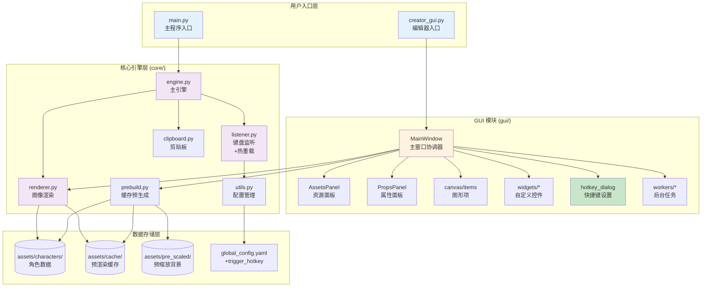
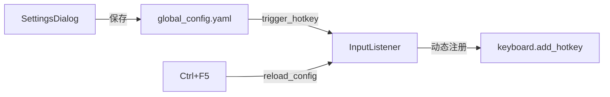

## CLAUDE.md

# 🎮 My Chat Window Can Not Be A GalGame - AI 上下文文档

**文档版本**: 2.4 (裁剪功能 + UI 优化)
**生成时间**: 2025-12-03
**项目版本**: v0.91
**项目类型**: Python 桌面应用 (Windows)
**核心技术栈**: PyQt6, Pillow, keyboard, pywin32
**Python 版本**: 3.10+

---

## 📋 项目愿景

将聊天体验 GalGame 化的通用工具，允许用户在任意聊天软件（QQ、微信、Discord 等）中输入文字后，自动渲染成带有角色立绘、对话框的精美图片，**粘贴到输入框后由用户手动确认发送**。

**核心价值**:

- 🚀 **自定义触发**: 支持用户自定义触发快捷键（默认 Enter，推荐 Shift+Enter）
- 🖼️ **预览后发送**: 图片生成后粘贴到输入框，用户确认无误后手动按 Enter 发送
- 🎭 **实时表情切换**: Alt+1~9 快捷键切换角色立绘
- 🎨 **自定义字体**: 支持为每个角色配置独立的 TrueType 字体
- ✂️ **自定义裁剪**: 灵活裁剪输出图片尺寸，想怎么发就怎么发
- 🛠️ **可视化编辑器**: 所见即所得的角色配置体验，标签页分类清晰
- ⚡ **高性能缓存**: 预处理机制 + 内存缓存，生成速度极快
- 🔄 **热重载配置**: Ctrl+F5 无需重启即可应用新设置

---

## 🏗️ 架构总览



---

## 📦 模块索引

### 🔹 用户入口

| 文件               | 职责                      |
| ------------------ | ------------------------- |
| `main.py`        | 角色选择、引擎启动        |
| `creator_gui.py` | 编辑器启动入口 (约 20 行) |

### 🔹 GUI 模块 (`gui/`)

| 子模块           | 文件                           | 职责                                               |
| ---------------- | ------------------------------ | -------------------------------------------------- |
| **入口**   | `__init__.py`                | 暴露 `MainWindow`                                |
| **常量**   | `constants.py`               | 全局常量、`CanvasConfig` 管理器                  |
| **主窗口** | `main_window.py`             | UI 组装、业务协调、设置菜单                        |
| **画布**   | `canvas/items.py`            | `ResizableTextItem`, `ScalableImageItem`       |
| **控件**   | `widgets/color_button.py`    | `ColorButton`                                    |
| **控件**   | `widgets/asset_list.py`      | `AssetListWidget`                                |
| **控件**   | `widgets/dialogs.py`         | `NewCharacterDialog`, `PrebuildProgressDialog` |
| **控件**   | `widgets/hotkey_dialog.py`   | `SettingsDialog`, `HotkeyEdit`                 |
| **面板**   | `panels/assets_panel.py`     | 左侧资源库面板                                     |
| **面板**   | `panels/props_panel.py`      | 右侧属性面板                                       |
| **后台**   | `workers/prebuild_worker.py` | 缓存生成线程                                       |

### 🔹 核心引擎 (`core/`)

| 文件             | 核心类/函数                                      | 职责                                             |
| ---------------- | ------------------------------------------------ | ------------------------------------------------ |
| `engine.py`    | `GalGameEngine`                                | 协调监听器、渲染器、剪贴板，**不自动发送** |
| `listener.py`  | `InputListener`                                | **可配置快捷键**、热重载、暂停切换         |
| `renderer.py`  | `CharacterRenderer`                            | 加载资源、合成图像、绘制文字                     |
| `clipboard.py` | `get_text()`, `set_image()`                  | Win32 剪贴板读写                                 |
| `prebuild.py`  | `prebuild_character()`                         | 生成立绘×背景组合缓存                           |
| `utils.py`     | `load_global_config()`, `normalize_layout()` | 配置读写、布局归一化                             |

---

## 📂 目录结构

```text
项目根目录/
├── main.py                     # 主程序入口
├── creator_gui.py              # 编辑器入口 (精简后 ~30 行)
├── global_config.yaml          # 全局配置 (含 trigger_hotkey)
│
├── gui/                        # GUI 模块
│   ├── __init__.py             # 暴露 MainWindow
│   ├── constants.py            # 常量与 CanvasConfig
│   ├── main_window.py          # 主窗口 (~550 行)
│   ├── canvas/
│   │   ├── __init__.py
│   │   └── items.py            # 自定义图形项
│   ├── widgets/
│   │   ├── __init__.py
│   │   ├── color_button.py
│   │   ├── asset_list.py
│   │   ├── dialogs.py
│   │   └── hotkey_dialog.py    # 快捷键设置对话框
│   ├── panels/
│   │   ├── __init__.py
│   │   ├── assets_panel.py
│   │   └── props_panel.py
│   └── workers/
│       ├── __init__.py
│       └── prebuild_worker.py
│
├── core/                       # 核心引擎
│   ├── __init__.py
│   ├── engine.py               # ⭐ v2.2: 移除自动发送
│   ├── listener.py             # 支持可配置快捷键 + 热重载
│   ├── renderer.py
│   ├── clipboard.py
│   ├── prebuild.py
│   └── utils.py
│
└── assets/
    ├── characters/             # 角色数据
    │   └── <char_id>/
    │       ├── config.yaml     # 角色配置文件
    │       ├── portrait/       # 立绘目录
    │       ├── background/     # 背景目录
    │       ├── fonts/          # 自定义字体目录 (可选)
    │       │   └── custom.ttf
    │       └── textbox_bg.png  # 对话框背景
    ├── common/
    │   ├── fonts/
    │   │   └── LXGWWenKai-Medium.ttf  # 默认字体
    │   └── background/         # 公共背景
    ├── cache/                  # 预渲染缓存
    │   └── <char_id>/
    │       ├── p_1__b_1.jpg
    │       └── _meta.json
    └── pre_scaled/             # 预缩放背景
        └── characters/<char_id>/background/
```

---

## ⌨️ 快捷键体系

### 主程序快捷键 (main.py)

| 快捷键                                | 功能                        | 说明                                |
| ------------------------------------- | --------------------------- | ----------------------------------- |
| **用户自定义** (默认 `enter`) | **生成图片并粘贴** ⭐ | 图片粘贴到输入框，需手动 Enter 发送 |
| `Enter` (手动)                      | 发送图片                    | 用户确认后手动按下发送              |
| `Alt + 1~9`                         | 切换立绘                    | 切换到列表中的第 1~9 张立绘         |
| `Ctrl + F5`                         | **热重载配置**        | 无需重启应用新的快捷键设置          |
| `Ctrl + F12`                        | 暂停/恢复                   | 临时暂停拦截功能                    |
| `Esc`                               | 退出程序                    | 完全关闭后台监听                    |

### 编辑器快捷键 (creator_gui.py)

| 快捷键       | 功能               |
| ------------ | ------------------ |
| `Ctrl + N` | 新建角色           |
| `Ctrl + S` | 保存配置           |
| `Ctrl + ,` | **打开设置** |
| `Ctrl + R` | 重载界面           |
| `F5`       | 渲染预览           |

---

## 🔧 自定义快捷键功能

### 设计背景

原本固定使用 `Enter` 作为触发键会导致以下问题：

- 发送图片时误触发（输入框为空时按 Enter）
- 无法正常换行
- 与某些聊天软件的快捷键冲突

### 解决方案

支持用户自定义触发快捷键，推荐使用 `Shift+Enter` 或 `Ctrl+Enter`：

- **组合键不会拦截原生 Enter**，保留正常发送功能
- 只有按下组合键时才触发"文字转图片"

### 配置流程

```
1. 打开 GUI 编辑器
   └─ python creator_gui.py

2. 打开设置对话框
   └─ 文件 → 设置 (Ctrl+,)

3. 设置快捷键
   ├─ 点击预设按钮 (如 "Shift+Enter")
   └─ 或点击输入框手动录制

4. 保存设置
   └─ 点击"保存"按钮

5. 在 main.py 中应用
   └─ 按 Ctrl+F5 热重载
   └─ 看到提示: "🔄 触发快捷键已更新: enter → shift+enter"
```

### 实现架构



---

## 🎨 GUI 模块详解 (`gui/`)

### `widgets/hotkey_dialog.py`

#### `HotkeyEdit` - 快捷键录制输入框

```python
class HotkeyEdit(QLineEdit):
    """支持按键录制的输入框"""
    hotkeyChanged = pyqtSignal(str)  # 快捷键变更信号

    def keyPressEvent(self, event):
        # 收集修饰键 (Ctrl/Alt/Shift)
        # 获取主键名称
        # 组合成 "ctrl+shift+enter" 格式
        # 发射 hotkeyChanged 信号
```

**键名转换**: Qt 键码 → keyboard 库兼容名称

```python
key_map = {
    Qt.Key.Key_Return: "enter",
    Qt.Key.Key_Space: "space",
    Qt.Key.Key_F1: "f1",
    # ...
}
```

#### `SettingsDialog` - 设置对话框

```python
class SettingsDialog(QDialog):
    """快捷键设置对话框"""

    def _init_ui(self):
        # 快捷键输入区域
        self.hotkey_edit = HotkeyEdit()
  
        # 预设按钮: Enter / Ctrl+Enter / Shift+Enter / Alt+S
  
        # 使用说明提示
  
        # 保存/取消按钮

    def _save_and_close(self):
        # 验证快捷键有效性
        # 检查是否与系统快捷键冲突
        # 保存到 global_config.yaml
```

### `main_window.py` 变更

新增菜单项和方法：

```python
# _create_menus() 中新增:
action_settings = QAction("设置 (&Settings)...", self)
action_settings.setShortcut("Ctrl+,")
action_settings.triggered.connect(self.open_settings)
file_menu.addAction(action_settings)

# 新增方法:
def open_settings(self):
    """打开设置对话框"""
    from .widgets import SettingsDialog
    dialog = SettingsDialog(self)
    dialog.exec()
```

---

## ⚙️ Core 模块详解 (`core/`)

### `utils.py` - 配置管理

```python
GLOBAL_CONFIG_FILENAME = "global_config.yaml"
LEGACY_GLOBAL_CONFIG_FILENAME = "global_config.json"

DEFAULT_CONFIG: Dict[str, Any] = {
    "current_character": "yuraa",
    "trigger_hotkey": "enter",  # 触发快捷键
    "global_hotkeys": {
        "copy_to_clipboard": "ctrl+shift+c",
        "show_character": "ctrl+shift+v",
    },
    "render": {
        "cache_format": "jpeg",
        "jpeg_quality": 90,
        "use_memory_canvas_cache": True
    }
}
```

**核心函数**:
- `load_global_config()`：加载 `global_config.yaml`（自动兼容旧的 JSON 格式）
- `save_global_config()`：保存配置到 YAML 文件
- `normalize_style()`：为每个角色的 `style` 字段补齐 `mode`、`text_wrapper`、`basic`、`advanced` 结构，兼容旧版 `font_size/name_color` 写法，并自动处理台词前后缀与高级名字配置。

### `engine.py` - 主引擎 (v2.2 更新) ⭐

#### 核心变更：移除自动发送

```python
def _on_submit(self):
    # 1. 模拟 Ctrl+A 全选, Ctrl+X 剪切
    keyboard.send("ctrl+a")
    time.sleep(0.05)
    keyboard.send("ctrl+x")
    time.sleep(0.1)

    # 2. 获取剪贴板文本
    text = get_text().strip()

    if not text:
        print("🔕 剪贴板为空或非文本，尝试还原...")
        keyboard.send("ctrl+v")
        return

    print(f"📝 捕获文本: {text}")

    # 3. 渲染图片
    try:
        image = self.renderer.render(text, self.current_expression)
    except Exception as e:
        # ... 错误处理 ...

    # 4. 将图片写入剪贴板并粘贴（不自动发送）
    if set_image(image):
        time.sleep(0.1)
        keyboard.send("ctrl+v")
        # ⭐ v2.2: 移除自动发送，让用户手动确认
        # 旧代码: time.sleep(1); keyboard.press_and_release("enter")
        print("✅ 图片已粘贴到输入框，请按 Enter 发送")
    else:
        print("❌ 图片写入剪贴板失败")
        if set_text(text):
            keyboard.send("ctrl+v")
```

### `listener.py` - 键盘监听

#### 核心功能

```python
class InputListener:
    def __init__(self):
        config = load_global_config()
  
        # 读取可配置的触发快捷键
        self.trigger_hotkey: str = config.get("trigger_hotkey", "enter").lower().strip()
  
        # 判断是单键还是组合键（影响 suppress 行为）
        self._is_single_key = "+" not in self.trigger_hotkey
```

#### 快捷键注册逻辑

```python
def _register_trigger_hotkey(self):
    """注册触发快捷键"""
    # 单键（如 enter）需要 suppress=True 来拦截
    # 组合键（如 ctrl+enter）不需要 suppress
    suppress = self._is_single_key
    self.trigger_hotkey_handle = keyboard.add_hotkey(
        self.trigger_hotkey, 
        self._trigger_submit, 
        suppress=suppress
    )
```

#### 热重载功能

```python
def reload_config(self):
    """Ctrl+F5 触发的热重载"""
    config = load_global_config()
    new_hotkey = config.get("trigger_hotkey", "enter").lower().strip()

    if new_hotkey != self.trigger_hotkey:
        # 取消旧快捷键
        self._unregister_trigger_hotkey()
  
        # 更新配置
        self.trigger_hotkey = new_hotkey
        self._is_single_key = "+" not in self.trigger_hotkey
  
        # 注册新快捷键
        self._register_trigger_hotkey()
  
        print(f"🔄 触发快捷键已更新: {old} → {new_hotkey}")
```

---

## 📄 配置文件结构

### `global_config.yaml`

```yaml
current_character: yuraa          # 编辑器启动时默认选择的角色
trigger_hotkey: shift+enter       # 控制台模式下触发图片生成的快捷键
global_hotkeys:
  copy_to_clipboard: ctrl+shift+c # 控制台模式: 复制最后一张图到剪贴板
  show_character: ctrl+shift+v    # 控制台模式: 显示/隐藏角色窗口
render:
  cache_format: jpeg              # 预构建缓存格式：jpeg / png
  jpeg_quality: 90                # cache_format 为 jpeg 时使用的质量
  use_memory_canvas_cache: true   # 是否在内存缓存画布，减少 IO
```

> 注意：配置文件已从 JSON 格式迁移到 YAML 格式，代码会自动兼容旧的 `global_config.json` 文件。
> 画布分辨率改由各角色 `config.json` 中的 `layout._canvas_size` 控制，切换角色时会自动加载对应分辨率。

### 角色 `style` 结构 (`assets/characters/<id>/config.yaml`)

```yaml
style:
  mode: advanced                    # 名称样式模式: basic / advanced
  font_file: fonts/lolita.ttf       # 自定义字体路径 (可选，相对于角色目录)
  text_wrapper:
    type: preset                    # 台词前后缀类型: none / preset / custom
    preset: corner_double           # 预设类型: corner_single (「」) / corner_double (『』)
    prefix: "『"
    suffix: "』"
  basic:
    font_size: 40
    text_color: [255, 255, 255]
    name_font_size: 32
    name_color: [255, 85, 255]
  advanced:
    name_layers:
      warden:                       # 特定角色名的高级样式
        - text: "典"
          position: [0, 0]
          font_color: [195, 209, 231]
          font_size: 196
        - text: "狱"
          position: [200, 100]
          font_color: [255, 255, 255]
          font_size: 92
        - text: "长"
          position: [300, 50]
          font_color: [255, 255, 255]
          font_size: 147
      default:                      # 默认样式
        - text: "{name}"
          position: [0, 0]
          font_color: [255, 85, 255]
          font_size: 32
```

**样式配置说明**:
- **自定义字体** (v2.3 新增): 通过 `font_file` 字段指定角色专属字体，路径相对于角色目录（如 `fonts/lolita.ttf`）。未设置时使用默认的霞鹜文楷字体。
- **台词前后缀**: GUI 属性面板新增「台词前后缀」组合框，可选 `none` / 「」「」 / 『』『』 / 自定义前后缀，并直接写入 `text_wrapper`。
- **高级名称配置**: 勾选"启用高级名称配置"后会展开输入框，可编辑 `name_layers` 并点击"应用配置"即时保存，渲染器会按相对坐标叠加多层文本。
- 注意：样式配置存储在各角色的 `config.yaml` 中，而非全局配置文件。

### 快捷键格式说明

| 格式     | 示例                                       | 说明               |
| -------- | ------------------------------------------ | ------------------ |
| 单键     | `enter`, `space`, `f1`               | 需要 suppress 拦截 |
| 组合键   | `ctrl+enter`, `shift+enter`, `alt+s` | 不拦截原生按键     |
| 多修饰键 | `ctrl+shift+s`                           | 支持多个修饰键组合 |

---

## 🔄 核心工作流

### 主程序渲染流程 (v2.2 更新) ⭐

```
main.py → GalGameEngine
  ├─ ensure_character_cache()     # 检查/生成缓存
  ├─ CharacterRenderer(char_id)   # 初始化渲染器
  └─ InputListener 监听循环:
      ├─ 注册 trigger_hotkey (从配置读取)
      ├─ 注册 Ctrl+F5 → reload_config()  # 热重载
      ├─ 注册 Ctrl+F12 → toggle_pause()
      ├─ 注册 Alt+1~9 → 切换表情
      └─ trigger_hotkey 触发:
          ├─ Ctrl+A, Ctrl+X 提取文本
          ├─ renderer.render(text, portrait_key, bg_key)
          ├─ set_image(pil_img)      # 写入剪贴板
          ├─ Ctrl+V 粘贴图片到输入框
          └─ ⭐ 等待用户手动按 Enter 发送
```

### 用户操作流程 (v2.2)

```
1. 用户在聊天输入框输入文字
2. 按下触发快捷键 (默认 Enter 或自定义)
3. 程序自动:
   ├─ 全选并剪切文字
   ├─ 渲染成 GalGame 风格图片
   └─ 粘贴图片到输入框
4. ⭐ 用户检查图片预览
5. ⭐ 用户手动按 Enter 发送
```

### 快捷键设置流程

```
GUI: SettingsDialog
  ├─ 用户点击 HotkeyEdit 输入框
  ├─ keyPressEvent 捕获按键
  │   ├─ 收集修饰键 (Ctrl/Alt/Shift)
  │   ├─ 获取主键名称
  │   └─ 组合成 "shift+enter" 格式
  ├─ 用户点击"保存"
  │   ├─ 验证快捷键有效性
  │   ├─ 检查冲突 (esc, ctrl+c, ctrl+v 等)
  │   └─ save_global_config({"trigger_hotkey": "shift+enter"})
  │       └─ 保存到 global_config.yaml
  └─ 提示用户按 Ctrl+F5 应用

main.py: InputListener
  ├─ 用户按 Ctrl+F5
  ├─ reload_config() 被调用
  │   ├─ load_global_config()
  │   ├─ 比较新旧快捷键
  │   ├─ _unregister_trigger_hotkey()
  │   └─ _register_trigger_hotkey() (使用新快捷键)
  └─ 打印: "🔄 触发快捷键已更新: enter → shift+enter"
```

---

## 🎯 推荐快捷键配置

| 快捷键          | 优点           | 缺点               | 推荐场景                 |
| --------------- | -------------- | ------------------ | ------------------------ |
| `enter`       | 最自然         | 需要两次 Enter     | 习惯确认后发送           |
| `shift+enter` | 不影响正常发送 | 某些软件用这个换行 | **推荐大多数用户** |
| `ctrl+enter`  | 完全独立       | 需要记住           | 避免所有冲突             |
| `alt+s`       | 完全独立       | 不够直观           | 特殊需求                 |

---

## 🚀 快速上手

### 开发环境

```bash
# 克隆项目
git clone <repo_url>
cd My_Chat_Window_Can_Not_Be_A_GalGame

# 创建虚拟环境
python -m venv .venv
.venv\Scripts\activate

# 安装依赖
pip install -r requirements.txt
```

### 配置自定义快捷键

```bash
# 1. 运行编辑器
python creator_gui.py

# 2. 打开设置: 文件 → 设置 (Ctrl+,)

# 3. 选择 "Shift+Enter" 并保存

# 4. 运行主程序
python main.py

# 5. 按 Ctrl+F5 应用新快捷键
```

### 配置自定义字体 (v2.3 新增)

```bash
# 1. 运行编辑器
python creator_gui.py

# 2. 选择要配置的角色

# 3. 在右侧属性面板找到"自定义字体"
#    点击"选择字体文件..."

# 4. 选择 .ttf 字体文件
#    字体会自动复制到 assets/characters/<角色>/fonts/

# 5. 保存配置 (Ctrl+S)

# 6. 重新生成缓存 (F5)
#    工具 → 生成缓存

# 7. 预览效果
#    工具 → 渲染预览
```

---

## 🔧 常见开发任务

### 添加新的快捷键预设

编辑 `gui/widgets/hotkey_dialog.py`:

```python
presets = [
    ("Enter", "enter"),
    ("Ctrl+Enter", "ctrl+enter"),
    ("Shift+Enter", "shift+enter"),
    ("Alt+S", "alt+s"),
    ("F9", "f9"),  # 新增预设
]
```

### 添加新的系统快捷键

编辑 `core/listener.py` 的 `start()` 方法:

```python
# 添加新的全局快捷键
keyboard.add_hotkey("ctrl+f6", self.some_new_function)
```

### 调试快捷键问题

```python
# 在 listener.py 中添加调试输出
def _trigger_submit(self):
    print(f"[DEBUG] 触发键: {self.trigger_hotkey}")
    print(f"[DEBUG] 是否单键: {self._is_single_key}")
    print(f"[DEBUG] 目标窗口: {self.is_target_window_active()}")
```

---

## ⚠️ 已知限制

1. **仅支持 Windows**: 依赖 `win32clipboard`, `win32gui`
2. **需要管理员权限**: 全局键盘钩子可能需要提权
3. **文本换行**: 简单按字符宽度计算，不支持复杂排版
4. **缓存占用**: N 立绘 × M 背景 = N×M 张图片
5. **快捷键冲突**: 部分组合键可能被系统或其他软件占用

---

## 📊 项目统计

### 代码规模 (v2.2)

| 模块           | 文件数 | 说明                |
| -------------- | ------ | ------------------- |
| `gui/`       | 13     | 含 hotkey_dialog.py |
| `core/`      | 6      | engine.py v2.2 更新 |
| **总计** | 19+    | -                   |

### 版本更新历史

| 版本  | 主要变更                                                    |
| ----- | ----------------------------------------------------------- |
| v2.0  | GUI 模块化重构                                              |
| v2.1  | 自定义快捷键、热重载                                        |
| v2.2  | ⭐ 移除自动发送，改为手动确认发送                           |
| v2.3  | 🎨 自定义字体支持、YAML 配置优化                            |
| v2.4  | ✂️ 自定义裁剪功能、标签页 UI 重构、首次显示优化 (v0.91)    |

---

## 🆕 v2.4 新增功能详解 (v0.91)

### ✂️ 自定义裁剪功能

**问题背景**：有时候对话不需要图片展示的那么大，例如 1200x1200 的背景，可能只想发送 300x1200 的图片。

**解决方案**：新增自定义裁剪区域功能，允许用户灵活控制最终输出图片的尺寸。

#### 核心特性

1. **可视化裁剪框**：
   - 红色虚线框标识裁剪区域
   - 支持拖拽移动和调整大小
   - 实时显示裁剪区域尺寸

2. **非破坏性裁剪**：
   - 缓存保存完整图片
   - 裁剪在渲染时动态应用
   - 可随时调整裁剪区域无需重新生成缓存

3. **配置持久化**：
   ```yaml
   layout:
     enable_crop: true
     crop_area: [450, 0, 750, 1200]  # [x1, y1, x2, y2]
   ```

#### 使用方法

1. 在 GUI 编辑器中切换到 **📐 布局** 标签页
2. 勾选"启用裁剪"
3. 点击"显示/隐藏裁剪框"
4. 拖拽红色框调整裁剪区域
5. 保存配置（Ctrl+S）

#### 实现细节

- **新增文件**：`gui/canvas/items.py` 中的 `CropAreaItem` 类
- **渲染逻辑**：`core/renderer.py` 中的 `_apply_crop()` 方法
- **配置管理**：`core/utils.py` 中的 `normalize_layout()` 支持裁剪区域

---

### 🎨 标签页 UI 重构

**问题背景**：右侧属性面板内容过多，用户需要滚动查找设置项。

**解决方案**：将属性面板重构为标签页结构，按功能分类组织。

#### 新的标签页结构

1. **📋 基础** - 基本配置
   - 基本信息（显示名称）
   - 画布设置（分辨率）
   - 对话框（更换底图）

2. **🎨 样式** - 外观设置
   - 文字样式（正文/名字大小和颜色）
   - 自定义字体
   - 台词前后缀

3. **📐 布局** - 位置调整
   - 布局微调（立绘覆盖对话框）
   - 裁剪区域（新增）

4. **⚙️ 高级** - 高级功能
   - 多层名称效果（艺术字）

#### 改进亮点

- ✅ 清晰的功能分类，快速定位设置
- ✅ 每个标签页独立滚动，空间利用更高效
- ✅ 图标化标签，一目了然
- ✅ 渐进式复杂度，从简单到高级

---

### 🔧 首次显示优化

**问题背景**：第一次打开编辑器时，画布中的图片显示偏小。

**解决方案**：添加 `showEvent` 方法，在窗口首次显示时延迟调用 `fit_view()`。

#### 实现方式

```python
def showEvent(self, event):
    """窗口显示事件 - 首次显示时延迟调整视图"""
    super().showEvent(event)
    if self._first_show:
        self._first_show = False
        # 延迟 100ms 后调整视图，确保窗口已完全显示
        QTimer.singleShot(100, self.fit_view)
```

#### 效果

- ✅ 第一次打开编辑器时图片自动正确缩放
- ✅ 无需手动切换角色或重载界面
- ✅ 优雅且不影响性能

---

### 🎯 多层名称效果优化

**问题背景**：原有的"高级名称 YAML"配置界面繁琐，功能定位不清晰。

**解决方案**：重新设计为"多层名称效果"，明确功能定位。

#### 改进内容

1. **更清晰的命名**：
   - "启用高级名称 YAML" → "启用多层名称效果"
   - 明确这是用于实现多层文字叠加的功能

2. **更好的说明**：
   ```
   💡 多层名称效果可以实现复杂的文字叠加，例如：
      • 不同大小的文字组合
      • 渐变色文字效果
      • 艺术字排版
   ```

3. **完整的示例**：
   - Placeholder 中提供"典狱长"艺术字完整示例
   - 用户可以直接参考和修改

#### 使用场景

- **普通用户**（90%）：不需要勾选，使用基础的"名字 (大小/色)"即可
- **高级用户**（10%）：需要复杂艺术字效果时才勾选使用

---

**维护者**: OuroChival-Shizue, makoMako, IzumiShizuki

**开源协议**: MIT
