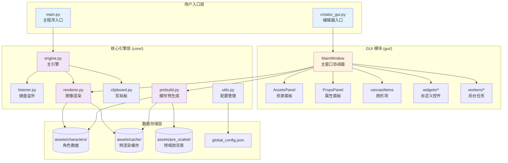
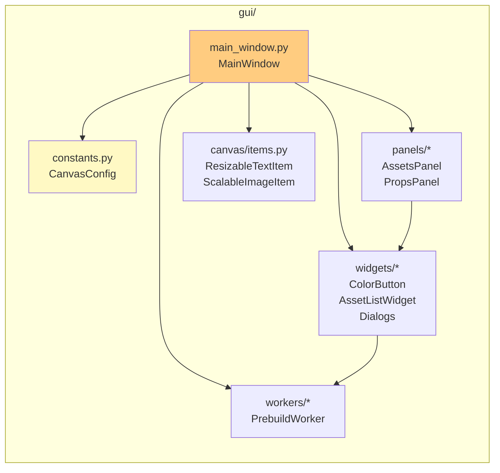

# 🎮 My Chat Window Can Not Be A GalGame - AI 上下文文档

**文档版本**: 2.0 (架构重构)
**生成时间**: 2025-11-28
**项目类型**: Python 桌面应用 (Windows)
**核心技术栈**: PyQt6, Pillow, keyboard, pywin32
**Python 版本**: 3.10+

---

## 📋 项目愿景

将聊天体验 GalGame 化的通用工具，允许用户在任意聊天软件（QQ、微信、Discord 等）中输入文字后，自动渲染成带有角色立绘、对话框的精美图片并发送。

**核心价值**:
- 🚀 **无感触发**: 按 Enter 自动生成并发送，无需手动截图
- 🎭 **实时表情切换**: Alt+1~9 快捷键切换角色立绘
- 🛠️ **可视化编辑器**: 所见即所得的角色配置体验
- ⚡ **高性能缓存**: 预处理机制 + 内存缓存，生成速度极快

---

## 🏗️ 架构总览



---

## 📦 模块索引

### 🔹 用户入口

| 文件 | 职责 |
|------|------|
| `main.py` | 角色选择、引擎启动 |
| `creator_gui.py` | 编辑器启动入口 (约 20 行) |

### 🔹 GUI 模块 (`gui/`)

详见: [GUI 模块详解](#-gui-模块详解-gui)

| 子模块 | 文件 | 职责 |
|--------|------|------|
| **入口** | `__init__.py` | 暴露 `MainWindow` |
| **常量** | `constants.py` | 全局常量、`CanvasConfig` 管理器 |
| **主窗口** | `main_window.py` | UI 组装、业务协调 |
| **画布** | `canvas/items.py` | `ResizableTextItem`, `ScalableImageItem` |
| **控件** | `widgets/color_button.py` | `ColorButton` |
| **控件** | `widgets/asset_list.py` | `AssetListWidget` |
| **控件** | `widgets/dialogs.py` | `NewCharacterDialog`, `PrebuildProgressDialog` |
| **面板** | `panels/assets_panel.py` | 左侧资源库面板 |
| **面板** | `panels/props_panel.py` | 右侧属性面板 |
| **后台** | `workers/prebuild_worker.py` | 缓存生成线程 |

### 🔹 核心引擎 (`core/`)

详见: [Core 模块详解](#-core-模块详解-core)

| 文件 | 核心类/函数 | 职责 |
|------|-------------|------|
| `engine.py` | `GalGameEngine` | 协调监听器、渲染器、剪贴板 |
| `listener.py` | `InputListener` | 目标软件识别、Enter 拦截、Alt+1~9 |
| `renderer.py` | `CharacterRenderer` | 加载资源、合成图像、绘制文字 |
| `clipboard.py` | `get_text()`, `set_image()` | Win32 剪贴板读写 |
| `prebuild.py` | `prebuild_character()` | 生成立绘×背景组合缓存 |
| `utils.py` | `load_global_config()`, `normalize_layout()` | 配置读写、布局归一化 |

---

## 📂 目录结构

```text
项目根目录/
├── main.py                     # 主程序入口
├── creator_gui.py              # 编辑器入口 (精简后)
├── global_config.json          # 全局配置
│
├── gui/                        # GUI 模块 (重构后)
│   ├── __init__.py             # 暴露 MainWindow
│   ├── constants.py            # 常量与 CanvasConfig
│   ├── main_window.py          # 主窗口 (~500 行)
│   ├── canvas/
│   │   ├── __init__.py
│   │   └── items.py            # 自定义图形项
│   ├── widgets/
│   │   ├── __init__.py
│   │   ├── color_button.py
│   │   ├── asset_list.py
│   │   └── dialogs.py
│   ├── panels/
│   │   ├── __init__.py
│   │   ├── assets_panel.py
│   │   └── props_panel.py
│   └── workers/
│       ├── __init__.py
│       └── prebuild_worker.py
│
├── core/                       # 核心引擎
│   ├── __init__.py
│   ├── engine.py
│   ├── listener.py
│   ├── renderer.py
│   ├── clipboard.py
│   ├── prebuild.py
│   └── utils.py
│
└── assets/
    ├── characters/             # 角色数据
    │   └── <char_id>/
    │       ├── config.json
    │       ├── portrait/
    │       ├── background/
    │       └── textbox_bg.png
    ├── common/
    │   ├── fonts/
    │   │   └── LXGWWenKai-Medium.ttf
    │   └── background/         # 公共背景
    ├── cache/                  # 预渲染缓存
    │   └── <char_id>/
    │       ├── p_1__b_1.jpg
    │       └── _meta.json
    └── pre_scaled/             # 预缩放背景
        └── characters/<char_id>/background/
```

---

## 🎨 GUI 模块详解 (`gui/`)

### 架构设计



### `constants.py` - 全局常量与配置

```python
# 关键常量
BASE_PATH = "assets"
DEFAULT_CANVAS_SIZE = (2560, 1440)
COMMON_RESOLUTIONS = [(1280, 720), (1920, 1080), (2560, 1440), ...]

# Z-Index 层级
Z_BG = 0
Z_PORTRAIT_BOTTOM = 10
Z_BOX = 20
Z_PORTRAIT_TOP = 25
Z_TEXT = 30

# CanvasConfig 单例 - 替代全局变量
class CanvasConfig:
    @classmethod
    def get_size(cls) -> Tuple[int, int]: ...
    @classmethod
    def set_size(cls, width: int, height: int): ...
    @classmethod
    def load_from_global_config(cls) -> Tuple[int, int]: ...
```

### `main_window.py` - 主窗口

**职责**: UI 组装、信号槽连接、业务逻辑协调

**关键方法**:

| 方法 | 职责 |
|------|------|
| `_init_ui()` | 创建菜单、画布、Dock 面板 |
| `_connect_signals()` | 连接所有子组件信号 |
| `load_config()` | 加载角色 config.json |
| `rebuild_scene()` | 重建 QGraphicsScene |
| `save_config()` | 采集 Scene 数据并保存 |
| `_apply_canvas_size()` | 切换分辨率并缩放布局 |

### `canvas/items.py` - 自定义图形项

#### `ResizableTextItem`

可拖动、可调整大小的文本框预览

```python
# 状态机
STATE_IDLE = 0      # 空闲
STATE_MOVE = 1      # 拖动
STATE_RESIZE = 2    # 调整大小

# 方向位掩码
DIR_LEFT = 0x01
DIR_RIGHT = 0x02
DIR_TOP = 0x04
DIR_BOTTOM = 0x08
DIR_TOP_LEFT = DIR_TOP | DIR_LEFT  # 0x05
# ...
```

#### `ScalableImageItem`

支持滚轮缩放的图片项

```python
def wheelEvent(self, event):
    if self.isSelected():
        factor = 1.05 if event.delta() > 0 else 0.95
        self.setScale(max(0.1, min(self.scale() * factor, 5.0)))
```

### `widgets/` - 自定义控件

| 控件 | 信号 | 用途 |
|------|------|------|
| `ColorButton` | `colorChanged(list)` | 颜色选择器 |
| `AssetListWidget` | `fileDropped(str)`, `deleteRequested(str)` | 资源列表 (支持拖拽/右键删除) |
| `NewCharacterDialog` | - | 新建角色对话框 |
| `PrebuildProgressDialog` | - | 缓存生成进度对话框 |

### `panels/` - Dock 面板

| 面板 | 包含控件 |
|------|----------|
| `AssetsPanel` | `combo_char`, `list_portraits`, `list_backgrounds`, 添加按钮 |
| `PropsPanel` | `edit_name`, `spin_font_size`, `btn_text_color`, `combo_resolution`, `check_on_top` |

---

## ⚙️ Core 模块详解 (`core/`)

### `utils.py` - 配置管理

```python
# 默认配置结构
DEFAULT_CONFIG = {
    "current_character": "yuraa",
    "global_hotkeys": {...},
    "target_apps": ["QQ", "微信", "Discord", ...],
    "render": {
        "canvas_size": [2560, 1440],
        "cache_format": "jpeg",      # "jpeg" | "png"
        "jpeg_quality": 90,
        "use_memory_canvas_cache": True
    }
}

# 核心函数
def load_global_config() -> Dict[str, Any]: ...
def save_global_config(config: Dict) -> None: ...
def normalize_layout(layout: Dict, canvas_size: Tuple) -> Dict: ...
```

**`normalize_layout()` 功能**:
1. 检测 `_canvas_size` 与目标尺寸是否一致
2. 不一致时按比例缩放 `text_area`, `name_pos`, `stand_pos`, `box_pos`
3. 裁剪坐标到画布范围内

### `renderer.py` - 图像渲染器

```python
class CharacterRenderer:
    def __init__(self, char_id: str, base_path: str = "assets"):
        # 加载配置、立绘、背景、对话框、字体
        self.canvas_size = CANVAS_SIZE  # 从 global_config 读取
        self.use_memory_cache = True    # 内存缓存开关
        self._canvas_cache: Dict[Tuple[str, str], Image.Image] = {}

    def render(
        self,
        text: str,
        portrait_key: str = None,
        bg_key: str = None,
        speaker_name: str = None
    ) -> Image.Image:
        # 1. 获取底图 (缓存/实时渲染)
        # 2. 绘制文字
        # 3. 返回 PIL.Image
```

**缓存查找顺序**:
1. 内存缓存 `_canvas_cache`
2. 磁盘缓存 `assets/cache/<char_id>/p_<p>__b_<bg>.jpg`
3. 兼容旧格式 `.png`
4. 实时渲染 `_realtime_render()`

**背景加载优先级**:
1. `assets/pre_scaled/characters/<char_id>/background/` (预缩放)
2. `assets/characters/<char_id>/background/` (角色目录)
3. `assets/common/background/` (公共目录)

### `prebuild.py` - 缓存预生成

```python
def prebuild_character(
    char_id: str,
    base_path: str = "assets",
    cache_path: str = "assets/cache",
    force: bool = False,
    progress: ProgressCallback = None  # (event, current, total, message)
) -> None:
    # 1. 检查缓存完整性 (_cache_is_complete)
    # 2. 预处理背景到 pre_scaled 目录
    # 3. 生成所有 portrait × background 组合
    # 4. 写入 _meta.json 记录签名
```

**缓存完整性校验** (`_meta.json`):
```json
{
    "source_signature": "sha1_hash",  // 源文件哈希
    "canvas_size": [1920, 1080],
    "cache_format": "jpeg",
    "portrait_count": 5,
    "background_count": 3
}
```

**进度回调事件**:
| 事件 | 说明 |
|------|------|
| `start` | 开始预处理 |
| `prepare_bg` | 处理背景 |
| `composite` | 生成底图 |
| `skip` | 缓存已存在 |
| `done` | 完成 |
| `error` | 发生错误 |

---

## 📄 配置文件结构

### `global_config.json`

```json
{
    "current_character": "yuraa",
    "global_hotkeys": {
        "copy_to_clipboard": "ctrl+shift+c",
        "show_character": "ctrl+shift+v"
    },
    "target_apps": ["QQ", "微信", "WeChat", "Discord", "Telegram", "钉钉", "Tim"],
    "render": {
        "canvas_size": [1920, 1080],
        "cache_format": "jpeg",
        "jpeg_quality": 90,
        "use_memory_canvas_cache": true
    }
}
```

### `assets/characters/<char_id>/config.json`

```json
{
    "meta": {
        "name": "角色显示名称",
        "id": "char_id"
    },
    "assets": {
        "dialog_box": "textbox_bg.png"
    },
    "style": {
        "text_color": [255, 255, 255],
        "name_color": [253, 145, 175],
        "font_size": 46,
        "name_font_size": 46,
        "font_file": "可选：自定义字体文件名"
    },
    "layout": {
        "stand_pos": [842, 126],
        "stand_scale": 1.965,
        "box_pos": [0, 880],
        "text_area": [499, 1179, 2249, 1389],
        "name_pos": [624, 1086],
        "stand_on_top": false,
        "current_portrait": "1.png",
        "current_background": "1.png",
        "_canvas_size": [2560, 1440]
    }
}
```

---

## 🔄 核心工作流

### 编辑器流程

```
creator_gui.py
  └─ gui.MainWindow()
      ├─ _load_custom_font()          # 加载霞鹜文楷
      ├─ _init_ui()
      │   ├─ _create_menus()          # 文件/工具菜单
      │   ├─ QGraphicsScene/View      # 中央画布
      │   ├─ AssetsPanel (Dock)       # 左侧资源面板
      │   └─ PropsPanel (Dock)        # 右侧属性面板
      ├─ _connect_signals()           # 信号槽连接
      └─ _load_initial_data()         # 扫描角色目录
          └─ on_character_changed()
              ├─ load_config()
              ├─ refresh_asset_lists()
              ├─ update_ui_from_config()
              └─ rebuild_scene()
```

### 保存配置流程

```
save_config()
  ├─ _collect_scene_data()
  │   ├─ portrait_item.pos() → stand_pos
  │   ├─ portrait_item.scale() → stand_scale
  │   ├─ box_item.pos() → box_pos
  │   ├─ name_text.mapToScene() → name_pos
  │   └─ main_text.mapToScene() → text_area [x1, y1, x2, y2]
  └─ json.dump(config, config.json)
```

### 缓存生成流程

```
generate_cache()
  └─ PrebuildProgressDialog
      └─ PrebuildWorker (QThread)
          └─ prebuild_character(char_id, force=True, progress=callback)
              ├─ _prepare_background_images()  # 预缩放背景
              ├─ for portrait × background:
              │   ├─ 合成底图
              │   └─ 保存 JPEG/PNG
              └─ _write_cache_meta()  # 记录签名
```

### 主程序渲染流程

```
main.py → GalGameEngine
  ├─ ensure_character_cache()     # 检查/生成缓存
  ├─ CharacterRenderer(char_id)   # 初始化渲染器
  └─ InputListener 监听循环:
      └─ Enter (目标软件内):
          ├─ Ctrl+A, Ctrl+X 提取文本
          ├─ renderer.render(text, portrait_key, bg_key)
          │   ├─ _get_base_canvas()  # 从缓存加载
          │   └─ _draw_text()        # 绘制文字
          ├─ set_image(pil_img)      # 写入剪贴板
          └─ Ctrl+V 发送
```

---

## 🎯 性能优化机制

### 1. 三级缓存体系

| 层级 | 位置 | 内容 |
|------|------|------|
| **L1** | 内存 | `CharacterRenderer._canvas_cache` |
| **L2** | 磁盘 | `assets/cache/<char_id>/p_*__b_*.jpg` |
| **L3** | 预缩放 | `assets/pre_scaled/` (背景图) |

### 2. 缓存格式选择

| 格式 | 优点 | 缺点 | 推荐场景 |
|------|------|------|----------|
| JPEG | 文件小、加载快 | 有损压缩 | 默认选择 |
| PNG | 无损、支持透明 | 文件大 | 特殊需求 |

### 3. 智能缓存校验

通过 `_meta.json` 中的 `source_signature` (SHA1) 检测源文件变化：
- 配置文件修改时间
- 立绘文件修改时间/大小
- 背景文件修改时间/大小
- 画布尺寸、缓存格式

---

## 🚀 快速上手

### 开发环境

```bash
# 克隆项目
git clone <repo_url>
cd My_Chat_Window_Can_Not_Be_A_GalGame

# 创建虚拟环境
python -m venv .venv
.venv\Scripts\activate

# 安装依赖
pip install -r requirements.txt
```

### 运行编辑器

```bash
python creator_gui.py
# 或
run_gui.bat
```

### 运行主程序

```bash
python main.py
# 或
run_main.bat
```

---

## 🔧 常见开发任务

### 添加新的 GUI 控件

1. 在 `gui/widgets/` 下创建新文件
2. 在 `gui/widgets/__init__.py` 中导出
3. 在 `MainWindow._init_ui()` 中实例化
4. 在 `MainWindow._connect_signals()` 中连接信号

### 修改画布默认尺寸

编辑 `gui/constants.py`:
```python
DEFAULT_CANVAS_SIZE = (1920, 1080)  # 新默认值
```

### 添加新的缓存格式

1. 修改 `core/prebuild.py` 中的保存逻辑
2. 修改 `core/renderer.py` 中的加载逻辑
3. 更新 `global_config.json` 的 `render.cache_format` 校验

### 调试渲染问题

```python
# 在 renderer.py 中添加
pil_img.save("debug_output.png")  # 保存中间结果
```

---

## ⚠️ 已知限制

1. **仅支持 Windows**: 依赖 `win32clipboard`, `win32gui`
2. **需要管理员权限**: 全局键盘钩子可能需要提权
3. **文本换行**: 简单按字符宽度计算，不支持复杂排版
4. **缓存占用**: N 立绘 × M 背景 = N×M 张图片

---

## 📊 项目统计

### 代码规模 (重构后)

| 模块 | 文件数 | 最大单文件行数 |
|------|--------|----------------|
| `gui/` | 12 | ~500 行 |
| `core/` | 6 | ~400 行 |
| **总计** | 18+ | - |

### 重构收益

| 指标 | 重构前 | 重构后 |
|------|--------|--------|
| GUI 单文件行数 | 1439 行 | ~500 行 |
| GUI 模块数 | 1 | 12 |
| 可测试性 | 差 | 好 |
| 复用性 | 无 | 控件可独立使用 |

---

**维护者**: OuroChival-Shizue, makoMako, IzumiShizuki

**开源协议**: MIT

**文档工具**: Claude Code