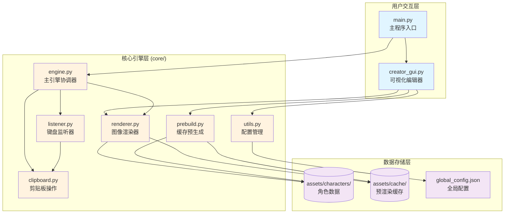

# 🎮 My Chat Window Can Not Be A GalGame - AI 上下文文档

**文档版本**: 1.1 (增量更新)
**生成时间**: 2025-11-28 14:14:40
**更新方式**: `/zcf:init-project` 增量初始化
**项目类型**: Python 桌面应用 (Windows)
**核心技术栈**: PyQt6, Pillow, keyboard, pywin32
**Python 版本**: 3.10+

---

## 📋 项目愿景

将聊天体验 GalGame 化的通用工具，允许用户在任意聊天软件（QQ、微信、Discord 等）中输入文字后，自动渲染成带有角色立绘、对话框的精美图片并发送。

**核心价值**:
- 🚀 **无感触发**: 按 Enter 自动生成并发送，无需手动截图
- 🎭 **实时表情切换**: Alt+1~9 快捷键切换角色立绘
- 🛠️ **可视化编辑器**: 所见即所得的角色配置体验
- ⚡ **高性能缓存**: 预处理机制，生成速度极快

---

## 🏗️ 架构总览



---

## 📦 模块索引

### 🔹 用户入口模块

| 模块 | 文档路径 | 职责 |
|------|----------|------|
| **主程序** | [main.py](./main.py) | 角色选择、引擎启动 |
| **可视化编辑器** | 详见: [docs/CREATOR_GUI.md](./docs/CREATOR_GUI.md) | 角色配置、立绘布局、实时预览 |
| **配置同步工具** | 详见: [docs/SYNC_CONFIG.md](./docs/SYNC_CONFIG.md) | 批量检查与修复角色配置文件 |

### 🔹 核心引擎模块 (`core/`)

详见: [core/CLAUDE.md](./core/CLAUDE.md)

| 模块 | 文件 | 核心功能 |
|------|------|----------|
| **主引擎** | [engine.py](./core/engine.py) | 协调监听器、渲染器、剪贴板，处理表情切换 |
| **键盘监听** | [listener.py](./core/listener.py) | 目标软件识别、Enter 拦截、Alt+1~9 快捷键 |
| **图像渲染** | [renderer.py](./core/renderer.py) | 加载资源、合成立绘/背景/对话框/文字 |
| **剪贴板** | [clipboard.py](./core/clipboard.py) | 读写文本/图片（Win32 API） |
| **预处理** | [prebuild.py](./core/prebuild.py) | 生成立绘×背景的所有组合缓存 |
| **配置管理** | [utils.py](./core/utils.py) | 读写 global_config.json |

### 🔹 资源与配置

| 路径 | 说明 |
|------|------|
| `assets/characters/<角色ID>/` | 角色数据目录（配置、立绘、背景、对话框） |
| `assets/characters/<角色ID>/config.json` | 角色配置：名称、布局、字体、颜色等 |
| `assets/common/fonts/` | 公共字体资源（默认：霞鹜文楷） |
| `assets/cache/<角色ID>/` | 预生成的立绘+背景组合图 |
| `global_config.json` | 全局配置：当前角色、目标软件白名单 |

---

## 🔄 核心工作流

### 1️⃣ 编辑器流程 (creator_gui.py)
```
用户新建角色
  → 导入立绘/背景/对话框素材
  → 拖拽调整布局（立绘位置/文本框区域）
  → 配置字体/颜色/缩放
  → 保存 config.json
  → 触发预渲染缓存生成
```

### 2️⃣ 主程序流程 (main.py → engine.py)
```
用户启动 main.py
  → 选择角色
  → 初始化 GalGameEngine:
      ├─ 调用 ensure_character_cache() 检查/生成缓存
      ├─ 初始化 CharacterRenderer 加载资源
      └─ 初始化 InputListener 启动键盘监听
  → 进入事件循环:
      ├─ Alt+1~9 → _on_switch_expression()
      └─ Enter (目标软件内) → _on_submit():
          ├─ Ctrl+A, Ctrl+X 提取文本
          ├─ renderer.render(text, expression)
          ├─ set_image() 写入剪贴板
          └─ Ctrl+V 发送
```

### 3️⃣ 渲染流程 (renderer.py)
```
render(text, portrait_key, bg_key)
  → 从缓存加载 "p_{立绘}__b_{背景}.png"
  → 绘制对话框 (已在缓存中)
  → 绘制文字:
      ├─ 计算多行自动换行
      ├─ 垂直居中
      └─ 使用配置的字体/颜色/大小
  → 返回 PIL.Image 对象
```

---

## 🎯 全局规范

### ✅ 代码约定
- **语言**: Python 3.10+
- **编码**: UTF-8
- **配置格式**: JSON (ensure_ascii=False, indent=4)
- **图像格式**: PNG (立绘/对话框需透明通道)
- **画布尺寸**: 2560×1440 (CANVAS_SIZE)

### ✅ 目录规范
```
assets/
├── characters/
│   └── <角色ID>/
│       ├── config.json          # 必须
│       ├── portrait/            # 必须：立绘目录
│       │   └── 1.png, 2.png...
│       ├── background/          # 必须：背景目录
│       │   └── 1.png, 2.png...
│       └── textbox_bg.png       # 必须：对话框图片
├── common/
│   └── fonts/
│       └── LXGWWenKai-Medium.ttf
└── cache/
    └── <角色ID>/
        └── p_1__b_1.png...      # 自动生成
```

### ✅ 配置结构 (config.json)
```json
{
  "meta": {
    "name": "角色名称",
    "id": "角色ID"
  },
  "assets": {
    "dialog_box": "textbox_bg.png"
  },
  "style": {
    "text_color": [255, 255, 255],
    "name_color": [253, 145, 175],
    "font_size": 46,
    "name_font_size": 46,
    "font_file": "可选：自定义字体文件名"
  },
  "layout": {
    "stand_pos": [842, 126],       // 立绘左上角坐标
    "box_pos": [0, 0],             // 对话框左上角坐标
    "text_area": [499, 1179, 2249, 1389],  // 文本区域 [x1,y1,x2,y2]
    "name_pos": [624, 1086],       // 角色名位置
    "stand_scale": 1.965,          // 立绘缩放比例
    "stand_on_top": false,         // 立绘是否在对话框上层
    "current_portrait": "1.png",   // 当前预览立绘
    "current_background": "1.png"  // 当前预览背景
  }
}
```

### ✅ 性能优化机制
1. **预渲染缓存**:
   - 启动时检查缓存完整性，缺失则自动生成
   - 缓存所有"立绘×背景"组合，运行时直接加载

2. **字体缓存**:
   - renderer.font_cache 按 (size, font_path) 缓存 ImageFont 对象

3. **异步键盘钩子**:
   - listener 使用子线程执行耗时操作，避免阻塞键盘事件

---

## 🚀 快速上手

### 开发环境配置
```bash
# 方式 A: 使用虚拟环境（推荐）
python -m venv .venv
.venv\Scripts\activate      # Windows
pip install -r requirements.txt

# 方式 B: 直接安装到系统 Python
pip install -r requirements.txt

# 运行编辑器（配置角色）
python creator_gui.py       # 或 run_gui.bat

# 运行主程序（启动引擎）
python main.py              # 或 run_main.bat
```

> 💡 批处理文件自动检测 `.venv` 目录，存在则使用虚拟环境，否则使用系统 Python。

### 关键依赖
- `Pillow>=10.0.0`: 图像处理
- `PyQt6>=6.6`: GUI 框架
- `keyboard>=0.13.5`: 全局键盘钩子
- `pyperclip>=1.8.2`: 跨平台剪贴板
- `pywin32>=306`: Windows 剪贴板图片操作

---

## 🔧 常见开发任务

### 添加新角色
1. 运行 `creator_gui.py`
2. `文件 → 新建角色`
3. 导入素材（立绘/背景/对话框）
4. 调整布局并保存
5. 编辑器会自动调用 `prebuild_character()` 生成缓存

### 修改目标软件白名单
编辑 `global_config.json` 中的 `target_apps` 数组

### 调试渲染问题
1. 检查 `assets/cache/<角色ID>/` 是否有缓存图片
2. 删除缓存后重新运行主程序触发自动重建
3. 在 `renderer.py` 中添加中间图片保存验证

### 修改快捷键
- **表情切换**: `listener.py:53-54` 修改 Alt+1~9
- **暂停拦截**: `listener.py:56` 修改 Ctrl+F12
- **退出监听**: `listener.py:60` 修改 Esc

---

## ⚠️ 已知限制

1. **仅支持 Windows**: 依赖 win32clipboard 和 win32gui
2. **需要管理员权限**: 全局键盘钩子可能需要提权
3. **目标软件检测**: 基于窗口标题匹配，部分软件标题可能不稳定
4. **文本换行**: 简单按字符数计算，不支持复杂排版
5. **缓存占用**: N 个立绘 × M 个背景 = N×M 张 2560×1440 图片

---

## 📚 文档完成度

### ✅ 已完成深度分析
- ✅ `core/` 模块 - 核心引擎层完整文档 (6 个文件)
- ✅ `creator_gui.py` - GUI 编辑器完整文档 (1869 行)
- ✅ `sync_config.py` - 配置同步工具完整文档 (88 行)
- ✅ `main.py` - 主程序入口 (60 行，简洁明了)

**总覆盖率**: 100% ✨

### 📖 实际配置示例
- `assets/characters/yuraa/config.json` - 可参考根级文档中的配置结构说明

---

## 📊 项目统计

### 代码规模
- **源代码文件**: 9 个 Python 文件
  - 用户入口层: 3 个 (`main.py`, `creator_gui.py`, `sync_config.py`)
  - 核心引擎层: 6 个 (`core/*.py`)
- **文档文件**: 4 个 Markdown 文档
  - 根级文档: `CLAUDE.md` (本文档)
  - 模块文档: `core/CLAUDE.md`, `docs/CREATOR_GUI.md`, `docs/SYNC_CONFIG.md`
- **配置文件**: 3 个 (`.serena/project.yml`, `global_config.json`, `requirements.txt`)
- **资产目录**: `assets/` (角色数据、缓存、公共资源)

### 模块识别结果
| 模块类型 | 路径 | 状态 |
|---------|------|------|
| 🎯 **主程序入口** | `main.py` | ✅ 已分析 |
| 🎨 **可视化编辑器** | `creator_gui.py` | ✅ 已分析 (1869 行) |
| 🔧 **配置同步工具** | `sync_config.py` | ✅ 已分析 (88 行) |
| ⚙️ **核心引擎包** | `core/` | ✅ 已分析 (6 个模块) |
| 📄 **文档目录** | `docs/` | ✅ 已生成导航文档 |

### 测试与质量
- **单元测试**: ❌ 暂无（项目处于早期阶段）
- **集成测试**: ❌ 暂无
- **代码风格检查**: ❌ 未配置
- **类型检查**: ❌ 未配置
- **持续集成**: ❌ 未配置

### 覆盖率分析
- **核心代码文档覆盖率**: 100% ✨
- **主要模块已分析**: 9/9 个 Python 文件
- **Mermaid 结构图**: ✅ 已生成 (架构总览 + core 模块依赖图)
- **导航面包屑**: ✅ 已添加 (所有子模块文档)

---

**维护者**: OuroChival-Shizue, makoMako
**开源协议**: MIT
**灵感来源**: [manosaba_text_box](https://github.com/oplivilqo/manosaba_text_box)
**文档工具**: Claude Code + Serena MCP Server
