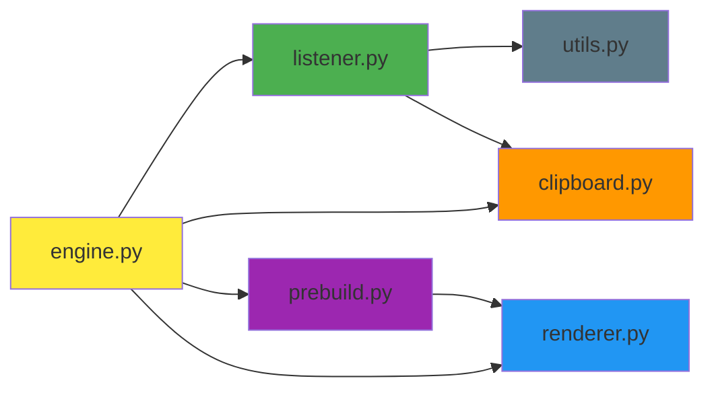

# 🔧 Core 模块 - 核心引擎层

**📍 导航**: [← 返回根目录](../CLAUDE.md) / **Core 模块**

---

## 📋 模块概览

Core 模块是 GalGame 引擎的核心业务逻辑层，负责键盘监听、图像渲染、剪贴板操作、资源预处理等关键功能。

**模块路径**: `core/`
**模块类型**: Python Package
**依赖项**: Pillow, keyboard, pyperclip, pywin32

---

## 📦 模块组成

| 文件 | 职责 | 关键类/函数 | 依赖 |
|------|------|------------|------|
| [engine.py](./engine.py) | 主引擎协调器 | `GalGameEngine` | listener, renderer, clipboard, prebuild |
| [listener.py](./listener.py) | 键盘监听器 | `InputListener` | keyboard, win32gui, utils |
| [renderer.py](./renderer.py) | 图像渲染器 | `CharacterRenderer` | Pillow (PIL) |
| [clipboard.py](./clipboard.py) | 剪贴板操作 | `get_text()`, `set_text()`, `set_image()` | pyperclip, win32clipboard |
| [prebuild.py](./prebuild.py) | 缓存预生成器 | `prebuild_character()`, `ensure_character_cache()` | Pillow (PIL) |
| [utils.py](./utils.py) | 配置管理 | `load_global_config()`, `save_global_config()` | json |

---

## 🔄 模块依赖关系



---

## 📄 文件详解

### 1️⃣ engine.py - 主引擎协调器

**核心类**: `GalGameEngine`

#### 职责
- 协调监听器、渲染器、剪贴板三大组件
- 管理当前表情状态
- 处理用户输入（Enter 发送、Alt+1~9 切换表情）

#### 关键方法

| 方法 | 签名 | 功能 |
|------|------|------|
| `__init__()` | `(char_id: str)` | 初始化引擎，加载角色资源，启动缓存检查 |
| `start()` | `() -> None` | 启动引擎主循环 |
| `_on_submit()` | `() -> None` | Enter 回调：提取文本 → 渲染图片 → 写入剪贴板 → 粘贴 |
| `_on_switch_expression()` | `(key: str) -> None` | Alt+数字 回调：切换立绘表情 |

#### 核心流程
```python
# 初始化流程
ensure_character_cache(char_id)  # 检查/生成缓存
renderer = CharacterRenderer(char_id)  # 加载资源
listener = InputListener()  # 初始化监听器

# 运行流程
listener.start(
    submit_callback=_on_submit,
    switch_callback=_on_switch_expression
)

# 发送流程 (_on_submit)
1. keyboard.send("ctrl+a")  # 全选
2. keyboard.send("ctrl+x")  # 剪切
3. text = get_text()  # 获取剪贴板文本
4. image = renderer.render(text, expression)  # 渲染图片
5. set_image(image)  # 写入剪贴板
6. keyboard.send("ctrl+v")  # 粘贴发送
```

#### 关键位置
- `engine.py:26-42`: 初始化流程与缓存检查
- `engine.py:74-108`: `_on_submit()` 完整发送流程
- `engine.py:57-72`: `_on_switch_expression()` 表情切换

---

### 2️⃣ listener.py - 键盘监听器

**核心类**: `InputListener`

#### 职责
- 全局键盘钩子监听
- 目标软件窗口识别（白名单机制）
- Enter 键拦截与透传逻辑
- Alt+1~9 快捷键绑定

#### 关键方法

| 方法 | 签名 | 功能 |
|------|------|------|
| `__init__()` | `()` | 加载目标软件白名单配置 |
| `start()` | `(submit_callback, switch_callback)` | 启动键盘监听循环 |
| `is_target_window_active()` | `() -> bool` | 检查当前窗口是否在白名单内 |
| `_trigger_submit()` | `() -> None` | Enter 触发逻辑（拦截/透传） |
| `_run_submit_async()` | `() -> None` | 子线程执行发送回调，避免阻塞 |
| `toggle_pause()` | `() -> None` | Ctrl+F12 切换暂停/恢复 |

#### 核心逻辑

**目标软件识别** (`is_target_window_active()`):
```python
hwnd = win32gui.GetForegroundWindow()
title = win32gui.GetWindowText(hwnd)
for app in self.target_apps:
    if app in title:
        return True
```

**Enter 拦截逻辑** (`_trigger_submit()`):
```
按下 Enter
  ├─ 是否暂停？
  │   ├─ 是 → 透传 Enter（临时移除钩子 → send("enter") → 重新挂钩）
  │   └─ 否 → 继续
  ├─ 是否在目标软件？
  │   ├─ 是 → 拦截并执行发送回调（子线程异步执行）
  │   └─ 否 → 透传 Enter
```

**异步执行机制** (`_run_submit_async()`):
```python
# listener.py:104-123
def _run_submit_async(self):
    """在子线程中执行发送逻辑"""
    try:
        keyboard.remove_hotkey(self.enter_hotkey)  # 临时移除钩子
        self.on_submit()  # 执行耗时操作
    finally:
        self.enter_hotkey = keyboard.add_hotkey(...)  # 恢复钩子
```

#### 快捷键绑定
```python
# listener.py:53-58
for i in range(1, 10):
    keyboard.add_hotkey(f"alt+{i}", self._safe_switch, args=(str(i),))
keyboard.add_hotkey("ctrl+f12", self.toggle_pause)
self.enter_hotkey = keyboard.add_hotkey("enter", self._trigger_submit, suppress=True)
keyboard.wait("esc")  # 阻塞直到按下 Esc
```

#### 关键位置
- `listener.py:30-40`: 窗口识别逻辑
- `listener.py:76-102`: Enter 拦截与透传核心逻辑
- `listener.py:104-123`: 子线程异步执行机制

---

### 3️⃣ renderer.py - 图像渲染器

**核心类**: `CharacterRenderer`

#### 新增亮点
- **全局渲染配置**：自动读取 `global_config.render` 的 `canvas_size / cache_format / use_memory_canvas_cache`，保持 GUI 与运行时一致。
- **预缩放背景**：优先加载 `assets/pre_scaled/...`，若不存在则自动缩放并缓存，避免重复放大 2K/4K 背景（文件名形如 `1@2560x1440.png`，标记了生成时的分辨率）。
- **底图内存缓存**：根据配置决定是否缓存 `portrait × background` 组合，提高多次发送同一表情的性能。

#### 关键流程
```python
config = load_global_config()
layout = normalize_layout(config["layout"], canvas_size)
base = renderer._get_base_canvas(p_key, b_key)  # 读取磁盘缓存或实时拼接
```

---

### 4️⃣ prebuild.py - 缓存预生成

**核心函数**: `prebuild_character`, `ensure_character_cache`

- **智能跳过**：利用 `_meta.json` 记录的 `source_signature`、画布尺寸、缓存格式来判断缓存是否失效。
- **进度回调**：`progress` 回调（start / prepare_bg / composite / done）可被 GUI 订阅，显示实时进度。
- **背景预缩放**：生成 `assets/pre_scaled/characters/<id>/background/`，并以 `原名@宽x高.png` 命名，方便区分不同画布尺寸。
- **可选输出格式**：支持 JPEG/PNG，同时尊重 `render.cache_format` 与 `render.jpeg_quality`。

#### 典型调用
```python
prebuild_character(
    char_id,
    base_path="assets",
    cache_path="assets/cache",
    force=True,
    progress=lambda event, cur, total, msg: ...
)
```

GUI 中的“生成缓存”按钮会启动 `PrebuildWorker(QThread)` 并在 `PrebuildProgressDialog` 中展示这些事件。

---

### 3️⃣ renderer.py - 图像渲染器

**核心类**: `CharacterRenderer`

#### 职责
- 加载角色配置与资源（立绘、背景、对话框、字体）
- 从缓存加载预合成底图
- 渲染多行文本（自动换行、垂直居中）
- 返回最终图片

#### 关键方法

| 方法 | 签名 | 功能 |
|------|------|------|
| `__init__()` | `(char_id: str, base_path: str)` | 加载配置与资源 |
| `render()` | `(text, portrait_key, bg_key, speaker_name)` | 主渲染方法 |
| `_load_resources()` | `() -> None` | 加载立绘/背景/对话框/字体 |
| `_get_font()` | `(size: int, font_path: str)` | 获取字体（带缓存） |
| `_first_key()` | `(dict)` | 获取字典第一个键（兜底） |
| `_resolve_font_path()` | `(font_file: str)` | 解析字体路径 |

#### 渲染流程

```python
# renderer.py:93-190 (简化版)
def render(text, portrait_key, bg_key, speaker_name):
    # 1. 从缓存加载底图（立绘+背景+对话框）
    cached_base = Image.open(f"cache/{char_id}/p_{portrait_key}__b_{bg_key}.png")
    canvas = cached_base.copy()

    # 2. 获取配置
    text_area = config["layout"]["text_area"]  # [x1, y1, x2, y2]
    font = self.assets["font"]
    color = config["style"]["text_color"]

    # 3. 计算多行文本
    lines = _wrap_text(text, max_chars_per_line=37)

    # 4. 计算垂直居中起始 Y 坐标
    total_height = len(lines) * line_height
    start_y = text_area[1] + (text_area[3] - text_area[1] - total_height) / 2

    # 5. 逐行绘制
    draw = ImageDraw.Draw(canvas)
    for i, line in enumerate(lines):
        y = start_y + i * line_height
        draw.text((text_area[0], y), line, font=font, fill=color)

    return canvas
```

#### 文本换行逻辑
```python
# renderer.py:172-182
def _wrap_text(text: str, max_chars_per_line: int = 37) -> List[str]:
    lines = []
    current = ""
    for char in text:
        if len(current) >= max_chars_per_line:
            lines.append(current)
            current = ""
        current += char
    if current:
        lines.append(current)
    return lines
```

#### 字体缓存
```python
# renderer.py:229-237
def _get_font(self, size: int, font_path: str) -> ImageFont.ImageFont:
    cache_key = (size, font_path)
    if cache_key in self.font_cache:
        return self.font_cache[cache_key]
    font = ImageFont.truetype(font_path, size)
    self.font_cache[cache_key] = font
    return font
```

#### 关键位置
- `renderer.py:43-88`: `_load_resources()` 资源加载
- `renderer.py:93-190`: `render()` 主渲染流程
- `renderer.py:172-182`: 文本换行计算
- `renderer.py:229-237`: 字体缓存机制

---

### 4️⃣ clipboard.py - 剪贴板操作

#### 导出函数

| 函数 | 签名 | 功能 | 平台 |
|------|------|------|------|
| `get_text()` | `() -> str` | 读取剪贴板文本 | 跨平台 (pyperclip) |
| `set_text()` | `(text: str) -> bool` | 写入剪贴板文本 | 跨平台 (pyperclip) |
| `set_image()` | `(image: Image.Image, retries: int, interval: float) -> bool` | 写入剪贴板图片 | Windows (win32clipboard) |

#### 核心逻辑

**文本操作**:
```python
# clipboard.py:21-35
def get_text() -> str:
    try:
        return pyperclip.paste() or ""
    except Exception:
        return ""

def set_text(text: str) -> bool:
    try:
        pyperclip.copy(text or "")
        return True
    except Exception:
        return False
```

**图片操作（Windows）**:
```python
# clipboard.py:38-59
def set_image(image: Image.Image, retries: int = 3, interval: float = 0.05) -> bool:
    for attempt in range(retries):
        try:
            buffer = BytesIO()
            image.convert("RGB").save(buffer, "BMP")
            data = buffer.getvalue()[14:]  # 移除 BMP 文件头，保留 DIB 数据

            win32clipboard.OpenClipboard()
            win32clipboard.EmptyClipboard()
            win32clipboard.SetClipboardData(win32clipboard.CF_DIB, data)
            win32clipboard.CloseClipboard()
            return True
        except Exception:
            # 重试逻辑：处理剪贴板占用冲突
            if attempt < retries - 1:
                time.sleep(interval)
    return False
```

#### 关键点
- **BMP Header**: 移除 14 字节文件头，只保留 DIB (Device Independent Bitmap) 数据
- **重试机制**: 默认 3 次重试，处理剪贴板被其他进程占用的情况
- **异常安全**: 所有函数均有异常捕获，失败时返回 False/空字符串

#### 关键位置
- `clipboard.py:38-59`: `set_image()` 核心实现与重试逻辑

---

### 5️⃣ prebuild.py - 缓存预生成器

#### 核心函数

| 函数 | 签名 | 功能 |
|------|------|------|
| `prebuild_character()` | `(char_id, base_path, cache_path, force)` | 生成角色的所有立绘×背景组合缓存 |
| `ensure_character_cache()` | `(char_id, base_path, cache_path)` | 检查缓存完整性，缺失则自动调用 `prebuild_character()` |
| `_cache_is_complete()` | `(char_id, portraits, backgrounds)` | 检查缓存是否完整 |
| `_fit_dialog_box_to_canvas()` | `(box_img)` | 缩放对话框至画布宽度并底部对齐 |

#### 预渲染流程

```python
# prebuild.py:49-129 (简化版)
def prebuild_character(char_id, force=False):
    # 1. 加载配置
    config = json.load(config_path)
    portraits = _list_images("portrait/")
    backgrounds = _list_images("background/")

    # 2. 检查缓存是否完整（跳过已有缓存）
    if not force and _cache_is_complete(char_id, portraits, backgrounds):
        return

    # 3. 加载并缩放对话框
    box_img, box_pos = _fit_dialog_box_to_canvas(dialog_box_img)

    # 4. 双层循环生成所有组合
    for portrait in portraits:
        p_img = resize_portrait(portrait, stand_scale)
        for background in backgrounds:
            # 创建画布
            canvas = Image.new("RGBA", (2560, 1440))

            # 粘贴背景
            canvas.paste(resize(background, (2560, 1440)), (0, 0))

            # 根据配置决定立绘与对话框叠放顺序
            if stand_on_top:
                canvas.paste(box_img, box_pos)
                canvas.paste(p_img, stand_pos)
            else:
                canvas.paste(p_img, stand_pos)
                canvas.paste(box_img, box_pos)

            # 保存缓存
            canvas.save(f"cache/{char_id}/p_{p_key}__b_{b_key}.png")
```

#### 缓存完整性检查
```python
# prebuild.py:27-35
def _cache_is_complete(char_id, portraits, backgrounds):
    expected_count = len(portraits) * len(backgrounds)
    cache_dir = f"assets/cache/{char_id}"
    existing_count = len([f for f in os.listdir(cache_dir) if f.endswith(".png")])
    return existing_count >= expected_count
```

#### 对话框适配
```python
# prebuild.py:38-46
def _fit_dialog_box_to_canvas(box_img):
    """缩放对话框至画布宽度，底部对齐"""
    if box_img.width != 2560:
        scale = 2560 / box_img.width
        new_height = int(box_img.height * scale)
        box_img = box_img.resize((2560, new_height), Image.LANCZOS)
    box_pos = (0, 1440 - box_img.height)  # 底部对齐
    return box_img, box_pos
```

#### 关键位置
- `prebuild.py:49-129`: `prebuild_character()` 完整预渲染流程
- `prebuild.py:132-143`: `ensure_character_cache()` 自动检查与生成
- `prebuild.py:27-35`: 缓存完整性检查逻辑

---

### 6️⃣ utils.py - 配置管理

#### 导出函数

| 函数 | 签名 | 功能 |
|------|------|------|
| `load_global_config()` | `() -> Dict[str, Any]` | 加载全局配置，缺失则创建默认配置 |
| `save_global_config()` | `(config: Dict) -> None` | 保存全局配置到 JSON 文件 |

#### 默认配置
```python
# utils.py:7-23
DEFAULT_CONFIG = {
    "current_character": "yuraa",
    "global_hotkeys": {
        "copy_to_clipboard": "ctrl+shift+c",
        "show_character": "ctrl+shift+v",
    },
    "target_apps": [
        "QQ", "微信", "WeChat", "Discord", "Telegram",
        "钉钉", "DingTalk", "Tim"
    ],
}
```

#### 加载逻辑
```python
# utils.py:26-46
def load_global_config():
    # 1. 尝试读取现有配置
    if os.path.exists(GLOBAL_CONFIG_PATH):
        config = json.load(GLOBAL_CONFIG_PATH)
    else:
        config = {}

    # 2. 合并默认值
    merged = DEFAULT_CONFIG.copy()
    merged.update(config)

    # 3. 验证必需字段
    if "target_apps" not in merged or not isinstance(merged["target_apps"], list):
        merged["target_apps"] = DEFAULT_CONFIG["target_apps"]

    # 4. 持久化（如果缺失或不完整）
    if merged != config:
        save_global_config(merged)

    return merged
```

#### 关键位置
- `utils.py:26-46`: 配置加载与默认值合并逻辑

---

## 🔗 模块间协作示例

### 完整发送流程（跨模块）

```
用户在 QQ 中按下 Enter
  ↓
[listener.py] InputListener._trigger_submit()
  ├─ is_target_window_active() → True (QQ 在白名单)
  ├─ 启动子线程 _run_submit_async()
  └─ 调用 on_submit 回调
      ↓
[engine.py] GalGameEngine._on_submit()
  ├─ keyboard.send("ctrl+a") + "ctrl+x"  # 提取文本
  ├─ [clipboard.py] get_text() → "你好"
  ├─ [renderer.py] render("你好", "1") → PIL.Image
  ├─ [clipboard.py] set_image(image)
  └─ keyboard.send("ctrl+v")
      ↓
QQ 发送图片
```

### 初始化流程（跨模块）

```
[main.py] 启动引擎
  ↓
[engine.py] GalGameEngine.__init__(char_id="yuraa")
  ├─ [prebuild.py] ensure_character_cache("yuraa")
  │   ├─ _cache_is_complete() → False
  │   └─ prebuild_character("yuraa")  # 生成 3×2=6 张缓存
  ├─ [renderer.py] CharacterRenderer("yuraa")
  │   ├─ _load_resources()
  │   │   ├─ 加载 3 张立绘
  │   │   ├─ 加载 2 张背景
  │   │   ├─ 加载对话框
  │   │   └─ _get_font() 初始化字体
  │   └─ 资源加载完成
  └─ [listener.py] InputListener()
      ├─ [utils.py] load_global_config()
      └─ 设置 target_apps 白名单
```

---

## 🎯 关键技术点

### 1. 键盘钩子的重入问题

**问题**: `keyboard.add_hotkey("enter", callback, suppress=True)` 拦截 Enter 后，如果在回调中使用 `keyboard.send("enter")` 会触发死循环。

**解决方案** (`listener.py`):
```python
# 临时移除钩子 → 发送 Enter → 重新挂钩
keyboard.remove_hotkey(self.enter_hotkey)
try:
    keyboard.send("enter")
finally:
    self.enter_hotkey = keyboard.add_hotkey("enter", self._trigger_submit, suppress=True)
```

### 2. 子线程避免阻塞

**问题**: 渲染图片 + 剪贴板操作耗时较长，直接在键盘钩子回调中执行会阻塞后续输入。

**解决方案** (`listener.py:104-123`):
```python
threading.Thread(target=self._run_submit_async).start()
```

### 3. 缓存策略

**问题**: 每次运行时合成立绘+背景+对话框耗时过长。

**解决方案** (`prebuild.py`):
- 首次运行时预生成所有"立绘×背景"组合
- 缓存文件命名: `p_{立绘名}__b_{背景名}.png`
- 运行时直接加载缓存，只需绘制文字

### 4. 字体缓存

**问题**: 每次渲染都调用 `ImageFont.truetype()` 会降低性能。

**解决方案** (`renderer.py:229-237`):
```python
font_cache: Dict[Tuple[int, str], ImageFont.ImageFont] = {}
```

---

## ⚠️ 已知问题与限制

1. **文本换行简陋**:
   - 按固定字符数切分，未考虑中英文宽度差异
   - 未处理标点符号避头尾规则

2. **错误处理不足**:
   - 大部分异常被静默捕获（`except Exception: pass`）
   - 缺少日志记录

3. **角色名称未实现**:
   - `render()` 接受 `speaker_name` 参数但未使用
   - 配置中有 `name_pos` 和 `name_color` 但未绘制

---

## 📊 模块统计

### 代码量分析
| 文件 | 行数 | 复杂度 | 主要类/函数数 |
|------|------|--------|--------------|
| engine.py | ~110 行 | 中等 | 1 类 + 4 方法 |
| listener.py | 119 行 | 高 | 1 类 + 7 方法 |
| renderer.py | ~240 行 | 高 | 1 类 + 8 方法 |
| clipboard.py | 48 行 | 低 | 3 个函数 |
| prebuild.py | ~145 行 | 中等 | 6 个函数 |
| utils.py | ~50 行 | 低 | 2 个函数 |

### 依赖关系
- **外部依赖**: 5 个 (Pillow, keyboard, pyperclip, pywin32, 标准库)
- **内部依赖**: 高耦合 (engine 依赖所有其他模块)
- **循环依赖**: ❌ 无

### 测试覆盖
- **单元测试**: ❌ 暂无
- **集成测试**: ❌ 暂无

---

**维护者**: OuroChival-Shizue, makoMako
**最后更新**: 2025-11-28 14:14:40
**文档工具**: Claude Code + Serena MCP Server
