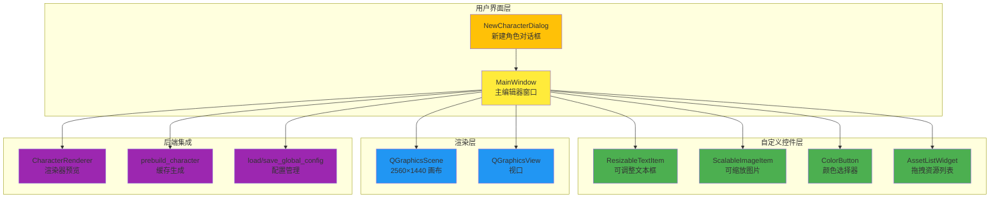

# 🎨 Creator GUI - 可视化编辑器模块

**📍 导航**: [← 返回根目录](../CLAUDE.md) / **可视化编辑器**

---

## 📋 模块概览

Creator GUI 是项目的可视化配置工具，提供所见即所得的角色编辑体验。用户通过拖拽、调整元素位置和大小，配置角色的立绘、对话框、文本区域等参数。

**文件路径**: `creator_gui.py` (1869 行)
**技术栈**: PyQt6 (Graphics View Framework)
**依赖**: core.renderer, core.prebuild, core.utils

---

## 🏗️ 架构概览



---

## 📦 核心组件详解

### 1️⃣ MainWindow - 主编辑器窗口

**类路径**: `creator_gui.py:329-1163`

#### 职责
- 角色配置的主界面
- 管理 Graphics Scene 和所有可视化元素
- 协调资源加载、配置读写、预览渲染

#### 核心属性

| 属性 | 类型 | 说明 |
|------|------|------|
| `current_char_id` | `str` | 当前编辑的角色 ID |
| `config` | `Dict` | 当前角色的完整配置 |
| `scene` | `QGraphicsScene` | 2560×1440 画布 |
| `scene_items` | `Dict` | 画布元素引用 (bg, portrait, box, name_text, main_text) |
| `custom_font_family` | `str` | 加载的自定义字体名称 |

#### 界面布局

**Dock 面板**:
- **左侧 (资源库)**: 角色选择、立绘列表、背景列表
- **右侧 (属性面板)**: 基本信息、样式设置、布局微调、对话框配置

**中央画布**: QGraphicsView 显示 2560×1440 场景

#### 关键方法

| 方法 | 签名 | 功能 |
|------|------|------|
| `_load_custom_font()` | `() -> None` | 加载霞鹜文楷字体 |
| `_init_ui()` | `() -> None` | 初始化菜单、Dock、Scene、View |
| `_create_assets_panel()` | `() -> QWidget` | 创建资源库面板 |
| `_create_props_panel()` | `() -> QWidget` | 创建属性面板 |
| `_load_initial_data()` | `() -> None` | 扫描角色目录并初始化 |
| `create_new_character()` | `() -> None` | 新建角色流程 |
| `on_character_changed()` | `(index: int) -> None` | 切换角色回调 |
| `load_config()` | `() -> None` | 加载角色 config.json |
| `refresh_asset_lists()` | `() -> None` | 刷新立绘/背景列表 |
| `rebuild_scene()` | `() -> None` | 重建 Graphics Scene |
| `_collect_scene_data()` | `() -> None` | 从 Scene 采集位置/缩放数据 |
| `save_config()` | `() -> None` | 保存配置到 JSON |
| `generate_cache()` | `() -> None` | 调用 prebuild_character 生成缓存 |
| `preview_render()` | `() -> None` | 调用 CharacterRenderer 实时渲染预览 |

---

### 2️⃣ ResizableTextItem - 可调整文本框

**类路径**: `creator_gui.py:61-207`

#### 职责
- 可拖动、可缩放的文本区域预览
- 8 个调整手柄（四角 + 四边）
- 实时显示文本、字号、颜色

#### 核心机制

**状态机**:
```python
STATE_IDLE = 0      # 空闲
STATE_MOVE = 1      # 拖动
STATE_RESIZE = 2    # 调整大小
```

**方向检测** (位掩码):
```python
DIR_LEFT = 0x01
DIR_RIGHT = 0x02
DIR_TOP = 0x04
DIR_BOTTOM = 0x08

DIR_TOP_LEFT = DIR_TOP | DIR_LEFT      # 左上角
DIR_BOTTOM_RIGHT = DIR_BOTTOM | DIR_RIGHT  # 右下角
# ...
```

#### 关键方法

| 方法 | 功能 | 关键逻辑 |
|------|------|----------|
| `hoverMoveEvent()` | 悬停时更新光标 | 调用 `_hit_test()` 检测手柄位置 |
| `mousePressEvent()` | 按下鼠标 | 判断点击位置决定进入 MOVE 或 RESIZE 状态 |
| `mouseMoveEvent()` | 拖动鼠标 | RESIZE 状态时计算新矩形，限制最小尺寸 50×30 |
| `_hit_test()` | 碰撞检测 | 检测鼠标是否在 HANDLE_SIZE (10px) 范围内 |
| `_update_cursor()` | 更新光标 | 根据方向设置对应光标（↔ ↕ ⤡ ⤢） |
| `paint()` | 绘制 | 绘制矩形框 + 文本内容 |

#### 缩放逻辑示例
```python
# creator_gui.py:134-149
def mouseMoveEvent(self, event):
    if self._state == self.STATE_RESIZE:
        delta = event.scenePos() - self._start_mouse_pos
        new_rect = QRectF(self._start_rect)
        min_w, min_h = 50, 30  # 最小尺寸限制

        # 位掩码判断方向
        if self._resize_dir & self.DIR_LEFT:
            new_rect.setLeft(min(new_rect.right() - min_w, new_rect.left() + delta.x()))
        if self._resize_dir & self.DIR_RIGHT:
            new_rect.setRight(max(new_rect.left() + min_w, new_rect.right() + delta.x()))
        # ... TOP/BOTTOM 同理

        self.setRect(new_rect)
```

---

### 3️⃣ ScalableImageItem - 可缩放图片

**类路径**: `creator_gui.py:209-223`

#### 职责
- 支持鼠标滚轮缩放的图片项
- 用于立绘的交互式调整

#### 核心逻辑
```python
# creator_gui.py:217-223
def wheelEvent(self, event):
    if self.isSelected():
        factor = 1.05 if event.delta() > 0 else 0.95  # 每次缩放 5%
        self.setScale(max(0.1, min(self.scale() * factor, 5.0)))  # 限制 0.1~5.0 倍
        event.accept()
```

---

### 4️⃣ ColorButton - 颜色选择器

**类路径**: `creator_gui.py:230-257`

#### 职责
- 显示当前颜色的按钮
- 点击弹出 QColorDialog
- 发射 `colorChanged` 信号

#### 核心代码
```python
# creator_gui.py:249-256
def pick_color(self):
    initial = QColor(self.current_color[0], self.current_color[1], self.current_color[2])
    new_color = QColorDialog.getColor(initial, self, "选择颜色")
    if new_color.isValid():
        rgb = [new_color.red(), new_color.green(), new_color.blue()]
        self.set_color(rgb)
        self.colorChanged.emit(rgb)  # 发送信号
```

---

### 5️⃣ AssetListWidget - 拖拽资源列表

**类路径**: `creator_gui.py:259-289`

#### 职责
- 支持文件拖拽导入
- 右键菜单删除文件
- 发射 `fileDropped` 和 `deleteRequested` 信号

#### 拖拽逻辑
```python
# creator_gui.py:275-279
def dropEvent(self, event: QDropEvent):
    for url in event.mimeData().urls():
        path = url.toLocalFile()
        if path.lower().endswith(('.png', '.jpg', '.jpeg')):
            self.fileDropped.emit(path)  # 发送信号给主窗口处理
```

#### 右键删除
```python
# creator_gui.py:281-288
def contextMenuEvent(self, event):
    item = self.itemAt(event.pos())
    if item:
        menu = QMenu(self)
        delete_action = QAction("删除此文件", self)
        delete_action.triggered.connect(lambda: self.deleteRequested.emit(item.text()))
        menu.addAction(delete_action)
        menu.exec(event.globalPos())
```

---

### 6️⃣ NewCharacterDialog - 新建角色对话框

**类路径**: `creator_gui.py:291-323`

#### 职责
- 输入角色 ID（文件夹名）和显示名称
- ID 自动填充到名称（如果名称为空）
- 返回用户输入数据

#### 关键方法
```python
# creator_gui.py:317-322
def _auto_fill_name(self, text):
    """ID 变化时自动填充名称"""
    if not self.edit_name.text():
        self.edit_name.setText(text)

def get_data(self):
    return self.edit_id.text().strip(), self.edit_name.text().strip()
```

---

## 🔄 核心流程详解

### 1️⃣ 启动与初始化流程

```
MainWindow.__init__()
  ├─ _load_custom_font()                  # 加载霞鹜文楷字体
  ├─ _init_ui()
  │   ├─ _create_menus()                  # 创建菜单栏
  │   ├─ QGraphicsScene(0, 0, 2560, 1440) # 创建画布
  │   ├─ QGraphicsView(scene)             # 创建视口
  │   ├─ _create_assets_panel()           # 创建资源库 Dock
  │   └─ _create_props_panel()            # 创建属性面板 Dock
  └─ _load_initial_data()
      ├─ 扫描 assets/characters/ 目录
      ├─ 加载 global_config.json 获取上次编辑的角色
      └─ 触发 on_character_changed()
```

---

### 2️⃣ 切换角色流程

```
on_character_changed(index)
  ├─ 更新 current_char_id, char_root, config_path
  ├─ 更新 global_config.json 记录当前角色
  ├─ load_config()                        # 加载角色 config.json
  ├─ refresh_asset_lists()                # 刷新立绘/背景列表
  ├─ update_ui_from_config()              # 同步 UI 控件状态
  └─ rebuild_scene()                      # 重建画布
      ├─ scene.clear()                    # 清空画布
      ├─ 加载背景图片 (current_background)
      ├─ 加载对话框图片 (dialog_box)
      │   └─ 自动缩放至画布宽度 2560px
      ├─ 加载立绘图片 (current_portrait)
      │   ├─ 应用 stand_scale 缩放
      │   └─ 设置位置 stand_pos
      ├─ 创建 ResizableTextItem (名字文本)
      │   └─ 位置: name_pos, 颜色: name_color
      ├─ 创建 ResizableTextItem (正文文本)
      │   └─ 区域: text_area, 颜色: text_color
      └─ 根据 stand_on_top 设置 Z 轴层级
```

---

### 3️⃣ 新建角色流程

```
create_new_character()
  ├─ 弹出 NewCharacterDialog 对话框
  ├─ 验证 ID 格式（仅字母数字下划线）
  ├─ 检查 ID 是否已存在
  ├─ 创建目录结构:
  │   ├─ assets/characters/{char_id}/
  │   ├─ assets/characters/{char_id}/portrait/
  │   └─ assets/characters/{char_id}/background/
  ├─ 生成默认 config.json:
  │   ├─ meta: {name, id}
  │   ├─ assets: {dialog_box: "textbox_bg.png"}
  │   ├─ style: {font_size: 45, text_color, name_color}
  │   └─ layout: {stand_pos, stand_scale, text_area, ...}
  ├─ 刷新角色列表
  └─ 自动切换到新角色
```

---

### 4️⃣ 保存配置流程

```
save_config()
  ├─ _collect_scene_data()                # 采集画布数据
  │   ├─ portrait_item.pos() → stand_pos
  │   ├─ portrait_item.scale() → stand_scale
  │   ├─ box_item.pos() → box_pos
  │   ├─ name_text.mapToScene() → name_pos
  │   └─ main_text.mapToScene() → text_area [x1, y1, x2, y2]
  ├─ 合并 UI 控件数据 (字号、颜色、名称等)
  └─ json.dump(config, config.json)       # 写入文件
```

---

### 5️⃣ 渲染预览流程

```
preview_render()
  ├─ save_config()                        # 先保存当前配置
  ├─ 弹出输入框获取测试台词
  ├─ CharacterRenderer(char_id)           # 初始化渲染器
  ├─ renderer.render(text, portrait_key, bg_key)
  ├─ PIL.Image.show()                     # 使用系统默认图片查看器
  └─ 异常处理 → QMessageBox.critical()
```

---

### 6️⃣ 缓存生成流程

```
generate_cache()
  ├─ save_config()                        # 保存最新配置
  ├─ prebuild_character(char_id, force=True)
  │   └─ 生成所有"立绘×背景"组合缓存
  └─ QMessageBox.information("缓存生成完毕")
```

---

## 🎨 Z-Index 层级体系

```python
# creator_gui.py:49-54
Z_BG = 0              # 背景层
Z_PORTRAIT_BOTTOM = 10  # 立绘（底层）
Z_BOX = 20            # 对话框
Z_PORTRAIT_TOP = 25   # 立绘（顶层）
Z_TEXT = 30           # 文本（最上层）
```

**层级逻辑**:
- `stand_on_top == False` → 立绘在对话框下方 (Z=10)
- `stand_on_top == True` → 立绘在对话框上方 (Z=25)
- 文本始终在最上层 (Z=30)

---

## 📄 配置文件结构

编辑器读写的 `config.json` 结构：

```json
{
  "meta": {
    "name": "角色显示名称",
    "id": "角色ID"
  },
  "assets": {
    "dialog_box": "textbox_bg.png"
  },
  "style": {
    "text_color": [255, 255, 255],
    "name_color": [253, 145, 175],
    "font_size": 46,
    "name_font_size": 46,
    "font_file": "可选：自定义字体"
  },
  "layout": {
    "stand_pos": [842, 126],          // 立绘左上角 (x, y)
    "stand_scale": 1.965,             // 立绘缩放比例
    "box_pos": [0, 0],                // 对话框左上角 (x, y)
    "text_area": [499, 1179, 2249, 1389],  // 文本区域 [x1, y1, x2, y2]
    "name_pos": [624, 1086],          // 角色名位置 (x, y)
    "stand_on_top": false,            // 立绘是否覆盖对话框
    "current_portrait": "1.png",      // 当前选中立绘
    "current_background": "1.png"     // 当前选中背景
  }
}
```

---

## 🔧 关键技术点

### 1. Graphics View Framework

**Scene-View 架构**:
```python
# creator_gui.py:369-374
self.scene = QGraphicsScene(0, 0, CANVAS_W, CANVAS_H)  # 固定 2560×1440
self.view = QGraphicsView(self.scene)
self.view.setRenderHints(QPainter.RenderHint.Antialiasing | QPainter.RenderHint.SmoothPixmapTransform)
self.view.setDragMode(QGraphicsView.DragMode.ScrollHandDrag)  # 手型拖动
```

**自适应缩放**:
```python
# creator_gui.py:843-846
def fit_view(self):
    self.view.resetTransform()
    self.view.fitInView(0, 0, CANVAS_W, CANVAS_H, Qt.AspectRatioMode.KeepAspectRatio)
    self.view.scale(0.95, 0.95)  # 留出 5% 边距
```

---

### 2. 自定义字体加载

```python
# creator_gui.py:354-364
def _load_custom_font(self):
    font_path = os.path.join(BASE_PATH, "common", "fonts", "LXGWWenKai-Medium.ttf")
    if os.path.exists(font_path):
        font_id = QFontDatabase.addApplicationFont(font_path)
        if font_id != -1:
            families = QFontDatabase.applicationFontFamilies(font_id)
            if families:
                self.custom_font_family = families[0]  # 获取字体族名称
```

---

### 3. 对话框自动贴底

```python
# creator_gui.py:982-992
def select_dialog_box(self):
    # ...
    pix = QPixmap(target_path)
    if not pix.isNull():
        scale = CANVAS_W / pix.width()        # 计算缩放比例
        scaled_h = pix.height() * scale       # 缩放后高度
        new_y = int(CANVAS_H - scaled_h)      # 底部对齐 Y 坐标

        self.config.setdefault("layout", {})["box_pos"] = [0, new_y]
```

---

### 4. 配置合并策略

```python
# creator_gui.py:675-681
def _merge_dicts(self, base, update):
    """递归合并配置，保留默认值同时应用用户修改"""
    for k, v in update.items():
        if isinstance(v, dict) and k in base:
            self._merge_dicts(base[k], v)  # 递归合并
        else:
            base[k] = v  # 覆盖或新增
    return base
```

---

### 5. Scene 数据采集

```python
# creator_gui.py:1096-1120
def _collect_scene_data(self):
    layout = self.config.setdefault("layout", {})

    # 立绘位置与缩放
    if self.scene_items["portrait"]:
        item = self.scene_items["portrait"]
        layout["stand_pos"] = [int(item.x()), int(item.y())]
        layout["stand_scale"] = round(item.scale(), 3)

    # 文本框 → text_area [x1, y1, x2, y2]
    if self.scene_items["main_text"]:
        item = self.scene_items["main_text"]
        rect = item.rect()
        p1 = item.mapToScene(rect.topLeft())    # 左上角
        p2 = item.mapToScene(rect.bottomRight()) # 右下角
        x1, y1 = int(p1.x()), int(p1.y())
        x2, y2 = int(p2.x()), int(p2.y())
        layout["text_area"] = [min(x1, x2), min(y1, y2), max(x1, x2), max(y1, y2)]
```

---

## 🔗 与其他模块的交互

### 与 Core 模块的集成

```
creator_gui.py
  ├─ 导入 core.utils
  │   ├─ load_global_config() → 获取上次编辑的角色
  │   └─ save_global_config() → 保存当前角色
  │
  ├─ 导入 core.renderer
  │   └─ CharacterRenderer.render() → 预览渲染 (preview_render)
  │
  └─ 导入 core.prebuild
      └─ prebuild_character() → 生成缓存 (generate_cache)
```

### 数据流

```
用户拖拽立绘调整位置
  ↓
ScalableImageItem.setPos()
  ↓
save_config() 触发
  ↓
_collect_scene_data()
  ├─ item.pos() → [x, y]
  └─ 写入 config["layout"]["stand_pos"]
  ↓
json.dump(config, config.json)
  ↓
main.py 启动时读取
  ↓
GalGameEngine → CharacterRenderer 使用配置渲染
```

---

## 📝 使用指南

### 新建角色完整流程

1. **启动编辑器**: `python creator_gui.py`
2. **新建角色**: `文件 → 新建角色` (Ctrl+N)
3. **填写信息**:
   - 角色 ID: `kotori` (仅字母数字下划线)
   - 显示名称: `五河琴里`
4. **导入资源**:
   - 点击 "立绘列表" 右侧 `+` 按钮，选择多张立绘
   - 点击 "背景列表" 右侧 `+` 按钮，选择一张背景
   - 点击 "更换底图" 按钮，选择对话框图片
5. **调整布局**:
   - 在画布中拖拽立绘到合适位置
   - 滚轮缩放立绘大小
   - 拖拽文本框调整位置和大小
6. **配置样式**:
   - 调整正文/名字字号
   - 点击颜色按钮选择文本颜色
7. **保存配置**: `Ctrl+S`
8. **生成缓存**: `工具 → 生成缓存`
9. **预览效果**: `F5` → 输入测试台词

---

## ⚠️ 已知限制

1. **缩放性能**: 大尺寸立绘实时缩放时可能卡顿
2. **撤销/重做**: 暂未实现操作历史功能
3. **自动保存**: 仅在手动保存时写入，易丢失未保存更改
4. **批量导入**: 仅支持单次多选，不支持拖拽导入

---

**维护者**: OuroChival-Shizue, makoMako
**最后更新**: 2025-11-28 14:14:40
**文档工具**: Claude Code + Serena MCP Server
