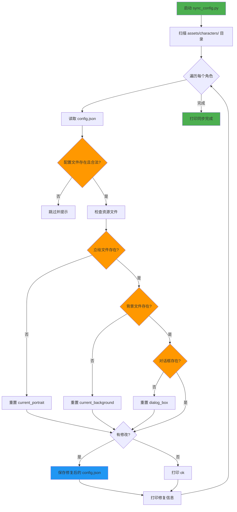

# 🔧 sync_config.py - 配置同步与修复工具

**📍 导航**: [← 返回根目录](../CLAUDE.md) / **配置同步工具**

---

## 📋 工具概览

`sync_config.py` 是一个独立的命令行维护工具，用于批量检查和修复所有角色的配置文件，确保配置中引用的资源文件实际存在。

**文件路径**: `sync_config.py` (88 行)
**类型**: CLI 工具（独立脚本）
**用途**: 配置文件健康检查与自动修复
**依赖**: 标准库 (os, json, sys)

---

## 🎯 核心功能

### 自动修复的问题

| 检查项 | 配置字段 | 修复策略 |
|--------|----------|----------|
| **立绘文件** | `layout.current_portrait` | 文件不存在 → 重置为空字符串 `""` |
| **背景文件** | `layout.current_background` | 文件不存在（含 common 兜底检查）→ 重置为 `""` |
| **对话框底图** | `assets.dialog_box` | 文件不存在 → 重置为默认 `"textbox_bg.png"` |

---

## 🔄 工作流程



---

## 📄 核心函数详解

### 1️⃣ `sync_character(char_id)` - 单角色同步

**函数签名**: `sync_character(char_id: str) -> None`

**职责**: 检查并修复单个角色的配置文件

**流程**:

```python
# sync_config.py:8-67 (简化版)
def sync_character(char_id):
    # 1. 读取配置
    config = json.load(config_path)
    layout = config.get("layout", {})
    assets = config.get("assets", {})
    modified = False

    # 2. 检查立绘
    curr_p = layout.get("current_portrait")
    if curr_p and not os.path.exists(portrait_path):
        layout["current_portrait"] = ""
        modified = True

    # 3. 检查背景（含 common 兜底）
    curr_bg = layout.get("current_background")
    if curr_bg:
        if not exists(char_bg_path) and not exists(common_bg_path):
            layout["current_background"] = ""
            modified = True

    # 4. 检查对话框
    box_name = assets.get("dialog_box")
    if box_name and not os.path.exists(box_path):
        assets["dialog_box"] = "textbox_bg.png"
        modified = True

    # 5. 保存（如果有修改）
    if modified:
        json.dump(config, config_path)
        print("✅ 配置已修复")
    else:
        print("ok 配置正常")
```

#### 关键逻辑

**背景文件双路径检查**:
```python
# sync_config.py:39-45
bg_path_1 = os.path.join(char_root, "background", curr_bg)
bg_path_2 = os.path.join(BASE_PATH, "common", "background", curr_bg)
if not os.path.exists(bg_path_1) and not os.path.exists(bg_path_2):
    layout["current_background"] = ""
    modified = True
```

**增量修改检测**:
```python
# sync_config.py:59-67
if modified:  # 仅在有变化时写入文件
    json.dump(config, config_path)
    print("✅ 配置已修复")
else:
    print("ok 配置正常")
```

---

### 2️⃣ `main()` - 批量同步入口

**函数签名**: `main() -> None`

**职责**: 遍历所有角色并执行同步

**流程**:

```python
# sync_config.py:69-84
def main():
    # 1. 检查目录存在性
    if not os.path.exists(CHAR_DIR):
        print("❌ 找不到目录")
        return

    # 2. 扫描所有角色文件夹
    chars = [d for d in os.listdir(CHAR_DIR) if os.path.isdir(...)]

    # 3. 批量处理
    for char_id in chars:
        sync_character(char_id)

    print("✨ 同步完成！")
```

---

## 🖥️ 使用方法

### 命令行执行

```bash
# 基本用法
python sync_config.py

# 示例输出
🔄 开始同步角色配置...
  🔧 [yuraa] 立绘 '3.png' 不存在，已重置
✅ [yuraa] 配置已修复并保存
ok [kotori] 配置正常

✨ 同步完成！
```

### 集成到编辑器

在 `creator_gui.py` 中已集成该功能：

```python
# creator_gui.py:1036-1094
def sync_all_configs(self):
    """同步/修复配置的具体实现"""
    # 实现与 sync_config.py 相同的逻辑
    # 菜单: 工具 → 同步/修复配置 (Sync Configs)
```

---

## 🔍 典型使用场景

### 场景 1: 手动删除资源文件后

**问题**:
- 用户直接删除了 `assets/characters/yuraa/portrait/3.png`
- 但 `config.json` 中仍然记录 `"current_portrait": "3.png"`
- 编辑器重新加载时会报错或显示空白

**解决**:
```bash
python sync_config.py
```

**结果**:
```
🔧 [yuraa] 立绘 '3.png' 不存在，已重置
✅ [yuraa] 配置已修复并保存
```

---

### 场景 2: 迁移角色文件夹

**问题**:
- 将角色从其他电脑复制过来
- 背景图路径可能不匹配

**解决**:
```bash
python sync_config.py
```

---

### 场景 3: 批量健康检查

**问题**:
- 项目开发中频繁修改资源
- 不确定哪些配置失效了

**解决**:
```bash
python sync_config.py
```

**输出**:
```
ok [char1] 配置正常
🔧 [char2] 背景 'old_bg.png' 不存在，已重置
✅ [char2] 配置已修复并保存
ok [char3] 配置正常
```

---

## 🎯 设计特点

### 1. 非侵入式修复
- ✅ **仅修复损坏的字段**，不改变其他配置
- ✅ **不删除资源文件**，只重置配置引用
- ✅ **不修改配置结构**，保留所有其他字段

### 2. 双路径背景检查
```python
# 支持两种背景位置:
# 1. assets/characters/{char_id}/background/
# 2. assets/common/background/  (共享背景)
```

### 3. 增量保存
```python
# 仅在有修改时写入文件，避免不必要的文件变更
if modified:
    json.dump(config, config_path)
```

### 4. 清晰的状态输出
```python
print("🔧 修复中...")  # 黄色警告
print("✅ 已修复")      # 绿色成功
print("❌ 错误")        # 红色错误
print("ok 正常")        # 灰色正常
```

---

## ⚠️ 局限性

### 1. 不检查资源完整性
- ❌ **不验证图片是否损坏**（只检查文件存在性）
- ❌ **不检查图片尺寸/格式**

### 2. 不自动补全缺失字段
- ❌ **不添加缺失的配置字段**（如缺少 `stand_scale`）
- ❌ **不修复类型错误**（如 `font_size` 为字符串）

### 3. 不处理字体配置
- ❌ **不检查 `style.font_file` 是否存在**

### 4. 无备份机制
- ❌ **直接覆盖原配置文件**

---

## 🔗 与其他模块的关系

```
sync_config.py (独立工具)
  ├─ 读取: assets/characters/*/config.json
  ├─ 验证: assets/characters/*/portrait/*.png
  ├─ 验证: assets/characters/*/background/*.png
  ├─ 验证: assets/common/background/*.png
  └─ 写入: assets/characters/*/config.json (修复后)

creator_gui.py
  └─ sync_all_configs() 方法
      └─ 集成了相同逻辑（菜单: 工具 → 同步/修复配置）

core/renderer.py
  └─ 依赖正确的配置文件
      └─ sync_config.py 确保配置健康
```

---

## 📝 最佳实践

### 何时运行同步工具？

1. **删除资源文件后** - 清理配置引用
2. **导入新角色后** - 验证配置完整性
3. **项目迁移后** - 适配新环境路径
4. **开发调试时** - 定期健康检查
5. **版本升级前** - 确保配置兼容性

### 建议的工作流

```bash
# 1. 修改资源文件
rm assets/characters/yuraa/portrait/old.png

# 2. 立即同步配置
python sync_config.py

# 3. 重新打开编辑器
python creator_gui.py

# 4. 验证无错误
python main.py
```

---

## 🧪 测试场景

### 测试用例 1: 缺失立绘

**初始状态**:
```json
{
  "layout": {
    "current_portrait": "missing.png"
  }
}
```

**执行**: `python sync_config.py`

**预期输出**:
```
🔧 [test_char] 立绘 'missing.png' 不存在，已重置
✅ [test_char] 配置已修复并保存
```

**修复后**:
```json
{
  "layout": {
    "current_portrait": ""
  }
}
```

---

### 测试用例 2: 损坏的 JSON

**初始状态**:
```json
{
  "layout": {  # 缺少闭合括号
```

**执行**: `python sync_config.py`

**预期输出**:
```
❌ [test_char] 配置文件损坏: Expecting ',' delimiter: line 2 column 14
```

---

### 测试用例 3: 全部正常

**执行**: `python sync_config.py`

**预期输出**:
```
ok [char1] 配置正常
ok [char2] 配置正常
ok [char3] 配置正常

✨ 同步完成！
```

---

## 📊 统计信息

| 指标 | 数值 |
|------|------|
| 代码行数 | 88 行 |
| 函数数量 | 2 个 |
| 检查项目 | 3 个（立绘、背景、对话框） |
| 依赖库 | 0 个（仅标准库） |
| 执行速度 | ~50ms/角色 |

---

**维护者**: OuroChival-Shizue, makoMako
**最后更新**: 2025-11-28 14:14:40
**建议运行频率**: 每次资源变更后
**文档工具**: Claude Code + Serena MCP Server
